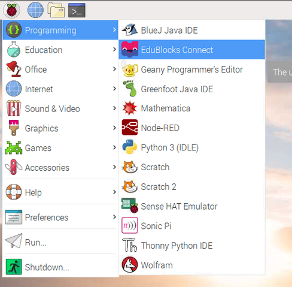
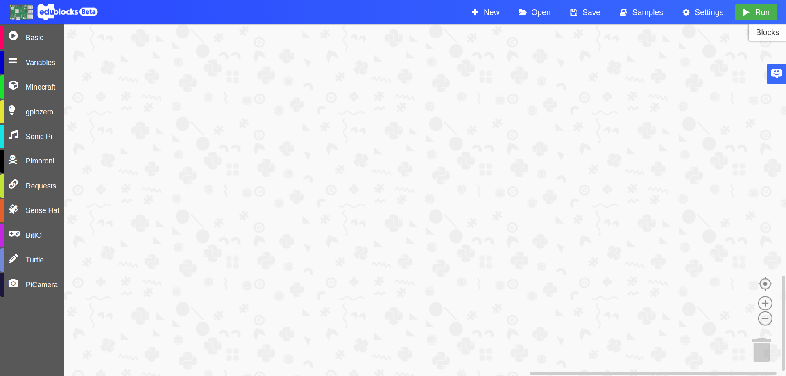
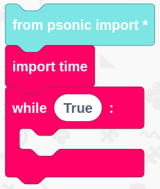
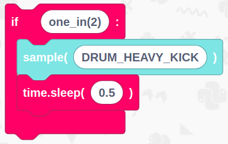
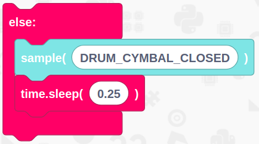
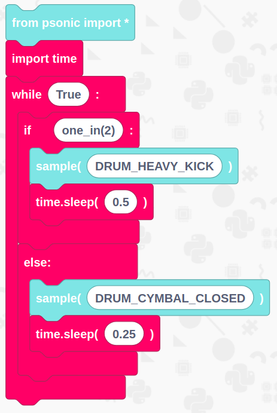
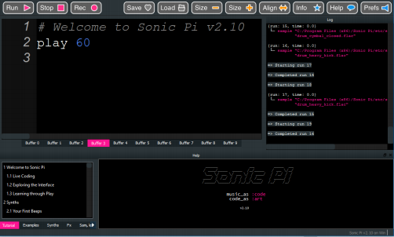

# Create a drum beat

## Overview

In this tutorial, we are going to use the Python-Soniclibrary in EduBlocks to create an effective drum beat to add to a performance.

You will need 
- An internet connection
- A setup Raspberry Pi with EduBlocks Connect or EduBlocks Desktop installed
- A speaker or headphones

## Get Started
Duration: 5:00

Once you've followed our Raspberry Pi getting started guide (if you haven't already done so), you'll want to launch EduBlocks connect. Go to the Raspberry Pi menu, select Programming and you'll see EduBlocks Connect Listed. Click on it to launch it. 

 

Now go back into the same menu, select Programming and launch Sonic Pi. This can take a few minutes to load, it is best not to click anywhere while this is
loading as it can crash the program.

You’ll now need to load up EduBlocks. You can do this by opening a web browser of your choice and typing [https://app.edublocks.org](https://app.edublocks.org) into the search box. Once you've loaded up EduBlocks, you'll be presented with the mode selector. 

 

Now, we want to select the mode. To do this simply click on the blue select button underneath the Raspberry Pi icon. This will load up the Raspberry Pi mode.
If you're on a raspberry pi, it will go straight to the mode if you have EduBlocks connect running. However, if you want to access this mode from a PC, you'll be given the option to connect to your Raspberry Pi by typing it it's IP Address.

Once you've selected the Raspberry Pi mode, you should see it pop up:

## Imports and loops
Duration: 1:00

Now its time to build our code. We can drag our code blocks from the EduBlocks toolbar which is on the left hand side of the screen. Our first  can be found in the Sonic Pi menu and our second and third block can be found in the Basic menu. In this section of code we are importing the Python-Sonic library which talks to Sonic Pi. The import time block will import the time library which we use to add sleeps. The last block will then create a forever loop.

## Create a drum kick
Duration: 2:00

Our next blocks can be found in the Basic & Sonic Pi sections of the toolbar (Pink in Basic and Blue in Sonic Pi). Drag them over to the workspace and put them inside of the while True loop we have just created . When entering text into blocks , click inside the white boxes then type into them. In this section of code we are creating a while true loop which will repeat the code inside it until the program stops. The if block will play the sample inside it every 1 in 2 beats. 

## Close the cymbal
Duration: 3:00

Now underneath the if block in the while true drag an else block which can be found in the Basic menu of the toolbar on the left hand side. The sample block can be found in the Sonic Pi menu and the sleep block can be found in the Basic menu. The code inside the else block will play whenever the code inside the if block is playing. If there was no else block in this code then nothing would play when the if block is not activated.

## Final Code
Duration: 1:00

You've now finished all of the code! It's time to check to see if we haven't missed a step or made a mistake. Now is your chance to check your code compared to the image below to check if it's all right.

## Run your code

Now it’s time to run our code. Click on the green run button in the top right hand corner of the EduBlocks window. You should now hear your drum beat through Sonic Pi.

Click the link below button to hear the outcome of our drumbeat:
[Play Drum Beat](https://drive.google.com/file/d/1RXrowuYukhRM9FpKmfoQgy2k1QD3iAz4/view)

### Outcome

In this tutorial we have learnt how to import libraries and use if & else to create a drum beat. We have also learnt about how we can make an if loop activate every second beat.