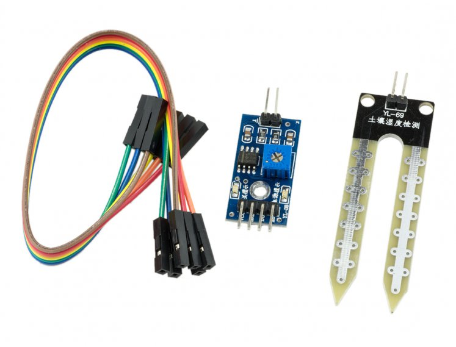
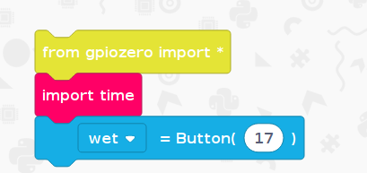
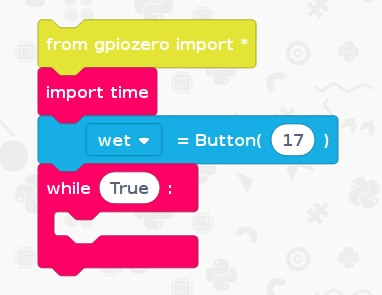
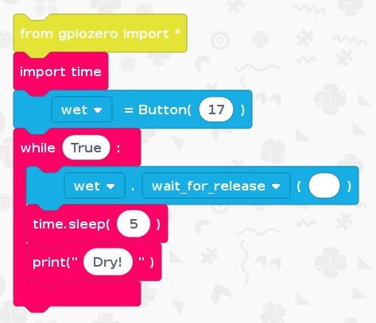
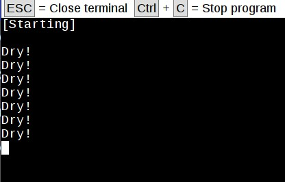
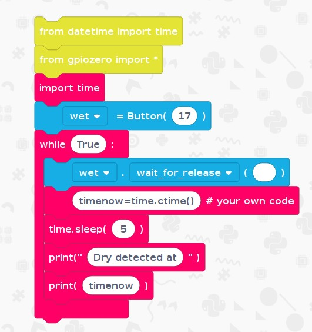
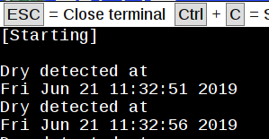

# Moisture Sensor
## Overview
This project shows how you can connect a low-cost moisture sensor to a Raspberry Pi and use EduBlocks to do something with its output - for example, to display "wet" or "dry" on the screen.

This can be used as part of a bigger project to automate the watering of a plant, for example.

You will need:
* An internet connection
* A Raspberry Pi with EduBlocks Connect installed. Follow the guide on the [Raspberry Pi page](https://edublocks.org/pi.html) to learn more.
* A moisture sensor from, for example, [Pimoroni](https://shop.pimoroni.com/products/sparkfun-soil-moisture-sensor-with-screw-terminals)

This consists of a **circuit board** and a **sensor** and possibly some jumper leads.

## Get started
Duration: 5:00
* Launch EduBlocks Connect (from the Pi's Programming menu)
* Launch a web browser and go to https://app.edublocks.org/
* When this has loaded, select Raspberry Pi **mode**.
* You should now see the blocks on the left of the screen

## Connecting the sensor
Duration: 5:00
* The **circuit board** needs
 * power (3.3V) and ground (0V) connections from the Pi's GPIO pins
 * a signal wire to a GPIO pin that will be used as an **input**
 * two wires to the actual **sensor**

The photo shows these connections.

The power wire (red) connects from the sensor board pin VDC to the Pi's pin 1 (3V3).
The ground wire (black) connects from the sensor board pin GND to the Pi's pin 9 (Ground)
The signal wire (orange) connects from the sensor board pin DO to the Pi's pin 11 (GPIO17)

positive
: **Note:** I found that the wires between the **circuit board** and the **sensor** can work loose, resulting in false "dry" readings. So I soldered the wires directly to the sensor.

 
## Setting up the library
Duration: 2:00

* Click on `gpiozero`
* Click on `General`
* Click and drag `from gpiozero import *` to the coding area and drop it there.
* Click on `Basic`
* Click and drag an `import time` block and attach it under `from gpiozero import *`

Your code should look like this:

 
## Setting up the pins
Duration: 2:00

* In the `gpiozero` menu click on `Inputs`
* Click on `Button`

positive
: We use the `Button` block because our sensor "looks" like a button switch to the Pi.

* Click and drag the `button=Button()` block to the code area and attach it under `import time`
* Now rename the button to "wet" (because the sensor "looks" like a closed button switch when the mositure is high): Click on the small arrow next to `button` and click on `Rename variable`. In the text box type `wet` and click OK.
* In the blank space between `()` type `17` (this corresponds to the GPIO pin on the Raspberry Pi) that the circuit board is connected to).
* Your code should look like this:

## Create a loop
Duration: 2:00

* Click on `Basic`
* Click and drag `while True` to the coding area and drop it there under the `wet=Button(17)` block.

Your code should look like this:

## Print the moisture level
Duration: 3:00

positive
: Now we are going to add a test: has the "button" been **released** (which means that the sensor is dry)?
We will also add a **time delay**, so that we test the moisture every 5 seconds, and also display some text on the screen.

* Click and drag the `button.wait_for_press()` block to the code area and attach it under `while True`
* Now change the `button` variable name to `wet`
* and then change the `wait_for_press` function to `wait_for_release`
* Click on `Basic`
* Click and drag `time.sleep` to the coding area and drop it there under the `wet.wait_for_release` block
* Change the sleep time to 5 seconds by typing `5` in the brackets after `time.sleep`
* Click and drag `print(" ")` to the coding area and drop it there under the `time.sleep` block
* Insert the text to display by typing `Dry!` in the brackets after `print("`

Your code should look like this:

## Test the code
Duration: 2:00

positive
: Now test your code - you will need a small jar of water to dip the sensor into.

* Click `Run` at the top of the edublocks screen
* When you take the sensor out of the water you should see "Dry!" displayed, every 5 seconds.
* When you put it back in the water the display will stop - because your code just waits until the sensor gets dry.

The display should look like this:

## (Optional) Print the time when the moisture changes
Duration: 5:00

positive
: This is an optional step: if you have time left then you could try adding the time at which the sensor changed to dry.
We will use some simple **python** code together with the edublocks.

This uses a function called `datetime`. We need to **import** this function first.
* Click `gpiozero`, then `General`
* Click and drag the `from datetime import time` block to the code area and attach it at the top of your existing blocks.

positive
: Now we need to store the **change time** in a new variable - we will call it `timenow`

* Click `Basic`
* Click and drag a `* your own code` block to the code area and attach it **below** the blue `wet=wait_for_release` block.

positive
: This block allows you to write your own **python** code!

* Type `timenow=time.ctime()` in the white space in that block. This puts the change time in the `timenow` variable.
* Change the text in the `print("Dry!")` block to `Dry detected at`
* Click and drag a `Basic` block called `print(variable)` and attach it under this last block.
* Type `timenow` in the white space in that block. This is the variable name that we used earlier.

Your code should look like this:

Your display should look like this:

---
