# Plant Waterer
## Overview
This project shows how you can:
* connect a low-cost water valve to a Raspberry Pi
* use a moisture sensor from another [tutorial](https://learn.edublocks.org/tutorial/moisture-sensor#0)
* write code to water a plant when its soil is dry

You will need:
* An internet connection
* A Raspberry Pi with EduBlocks Connect installed. Follow the guide on the [Raspberry Pi page](https://edublocks.org/pi.html) to learn more.
* A water valve, for example the ZE-4F180 from e-Gizmo Mechatronix Central (this valve requires a current of about 0.5A from a 12V supply):

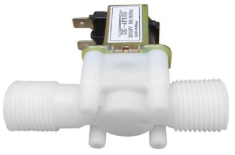
* A "relay" which translates the 3.3V output from a Raspberry Pi GPIO pin to a 12V signal; for example, the SRD05V from Songle (NB it must be able to handle the water valve current - i.e 0.5A for the valve above).

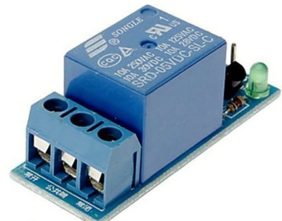

* A 12V at 1A (min) supply, for example:

* A 2.1 mm "barrel" jack socket - this is used to connnect the 12V supply to the relay board.

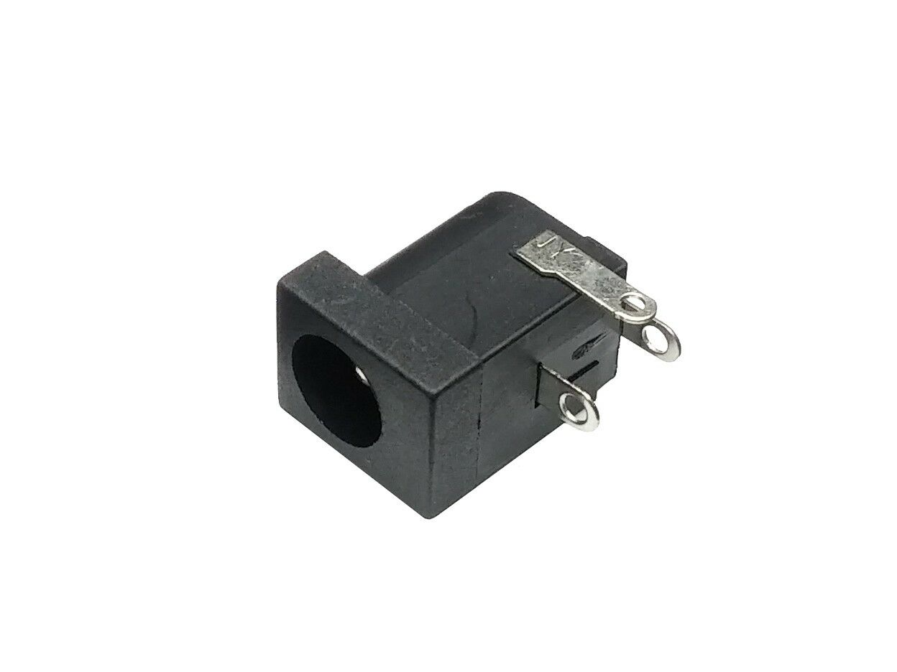

* You will also need some hose pipe and connectors - more on this later

## Mounting the relay board and jack socket
Duration: 10:00

The relay board doesn't have a convenient way to assemble it together with the jack socket, so I used a small piece of Vero board and stuck the relay board to it using a thin layer of Sugru. The jack socket is also mounted on the Vero board.

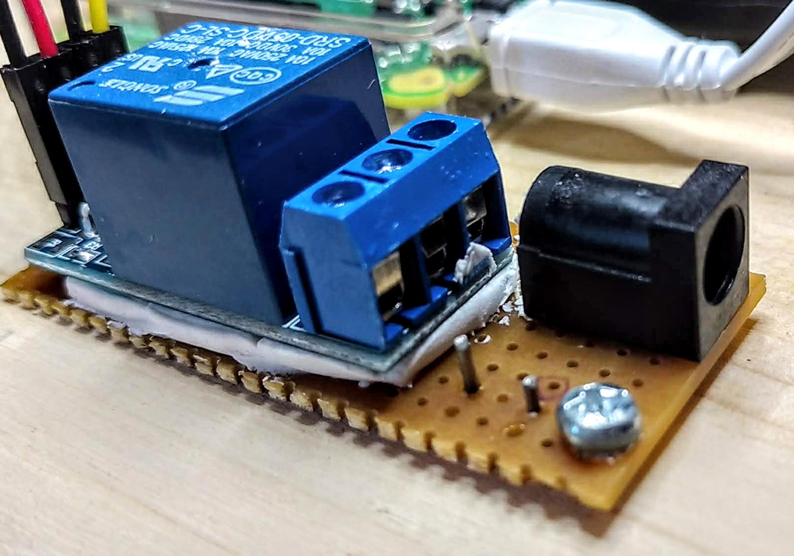

## Connecting the relay board to the Pi
Duration: 5:00

* The **relay board** needs
 * power (5V) and **two** ground (0V) connections from the Pi's GPIO pins
 * a signal wire from a GPIO pin that will be used as an **output**

The schematic (circuit diagram) below shows these connections.

From top to bottom we have:
* The signal wire (yellow) connects from the Pi's pin 12 (GPIO18) to the relay board's Control pin.
* The first ground wire (black) connects from the Pi's pin 14 (0V) to the relay board's GND pin.
* The power wire (red) connects from the Pi's pin 2 (5V) to the relay board's VCC pin.
* The second ground wire (black) connects from the Pi's pin 9 (0V) to the relay board's RGND pin.

Your assembly should look something like this:
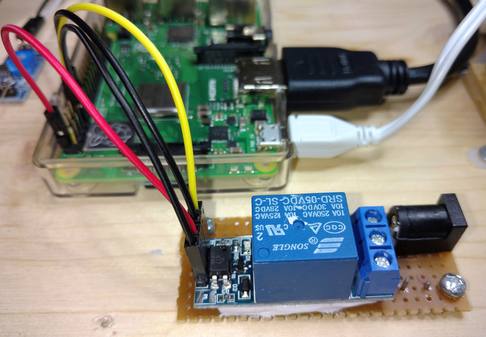

## Connecting the relay board to the water valve and 12V supply
Duration: 5:00

* We  need to connect the relay board to the 12V supply (via the barrel jack socket) and also to the water valve. The connections are shown on the right side of the schematic below.

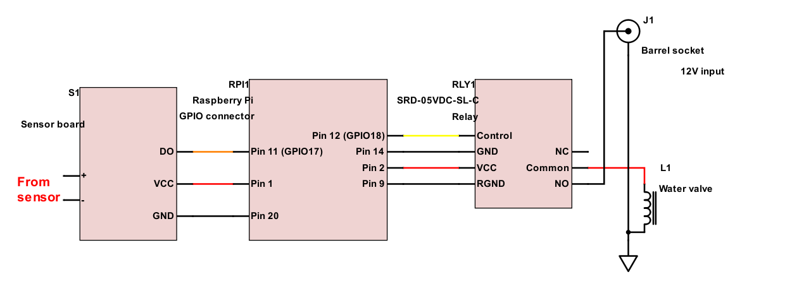

The relay board assembly should look something like this:
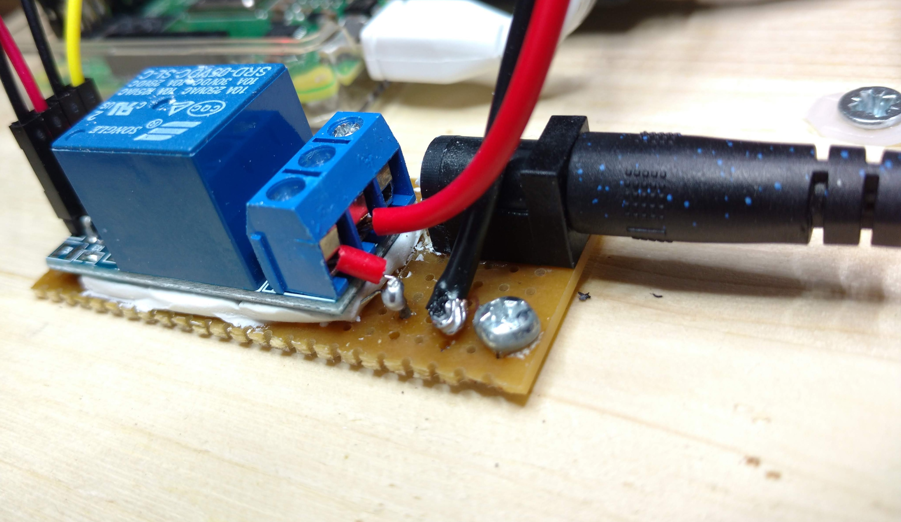

## Get started with the code
Duration: 2:00
* Launch EduBlocks Connect (from the Pi's Programming menu)
* Launch a web browser and go to https://app.edublocks.org/
* When this has loaded, select Raspberry Pi **mode**.
* You should now see the blocks on the left of the screen

## Setting up the library
Duration: 2:00

* Click on `gpiozero`
* Click on `General`
* Click and drag `from gpiozero import *` to the coding area and drop it there.
* Click on `Basic`
* Click and drag an `import time` block and attach it under `from gpiozero import *`

Your code should look like this:

## Setting up the pins
Duration: 1:00
* In the `gpiozero` menu click on `Outputs`
* Click on `LED`
 

positive
: We use the `LED` block because our relay "looks" like an LED to the Pi.

Click and drag the `led=LED()` block to the code area and attach it under `import time`

Now rename the "led" variable name to "water" - a more sensible name - by clicking on the small arrow next to `led` and then clicking on `Rename variable`. In the text box type `water` and click OK.

In the blank space between `()` type `18` (this corresponds to the GPIO pin on the Raspberry Pi that the circuit board is connected to).

Your code should look like this:
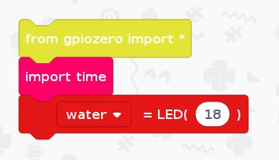

## Create a loop
Duration: 2:00

* Click on `Basic`
* Click and drag `while True` to the coding area and drop it there under the `water=LED(18)` block.

Your code should look like this:
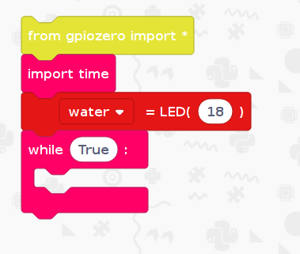

## Switch the valve on and off every few seconds
Duration: 3:00

positive
: Now we are going to add code to switch the relay on, print **on** on the screen, then wait for a few seconds. Then we will switch the relay off, print **off**, then wait again before repeating the loop.

From the `gpiozero` block menu:
* choose `Outputs`
* click and drag the `led.on()`block to the code area and attach it under `while True`.
* change the `led` variable name to `water`.

 
From the `Basic` block menu:
* click and drag `print(" ")` to the coding area and drop it there under the `water.on()`block
* insert the text to display by typing `On` in the brackets after `print("`
* click and drag the `time.sleep(1)` block to the coding area and drop it there under the `print` block
* change time delay by changing the 1 in this block to, say, 8

Repeat the above three blocks, but this time change the `on` to `off`

Your code should look like this:
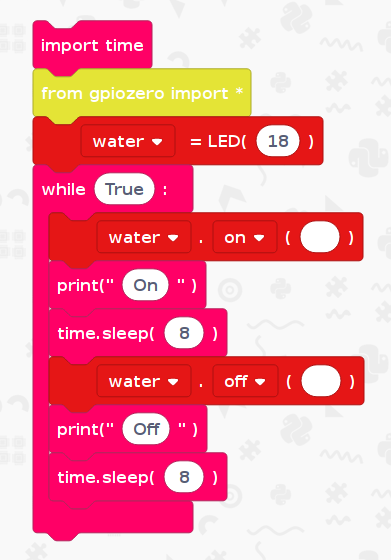

## Test the code
Duration: 2:00

Run the code.

You should see the relay switching on and off (it has an LED on the board) and you should also hear it.
The Edublocks screen will also show the text you programmed!

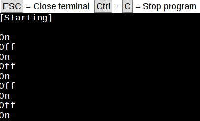

## Connect the moisture sensor
Duration: 2:00

In a previous project (moisture-sensor) we built code for a moisture senor.
We need to connect the sensor and its circuit board to the Raspberry Pi as shown on the left side of the complete schematic below:

The photo shows the complete assembly, but without the water supply connections.

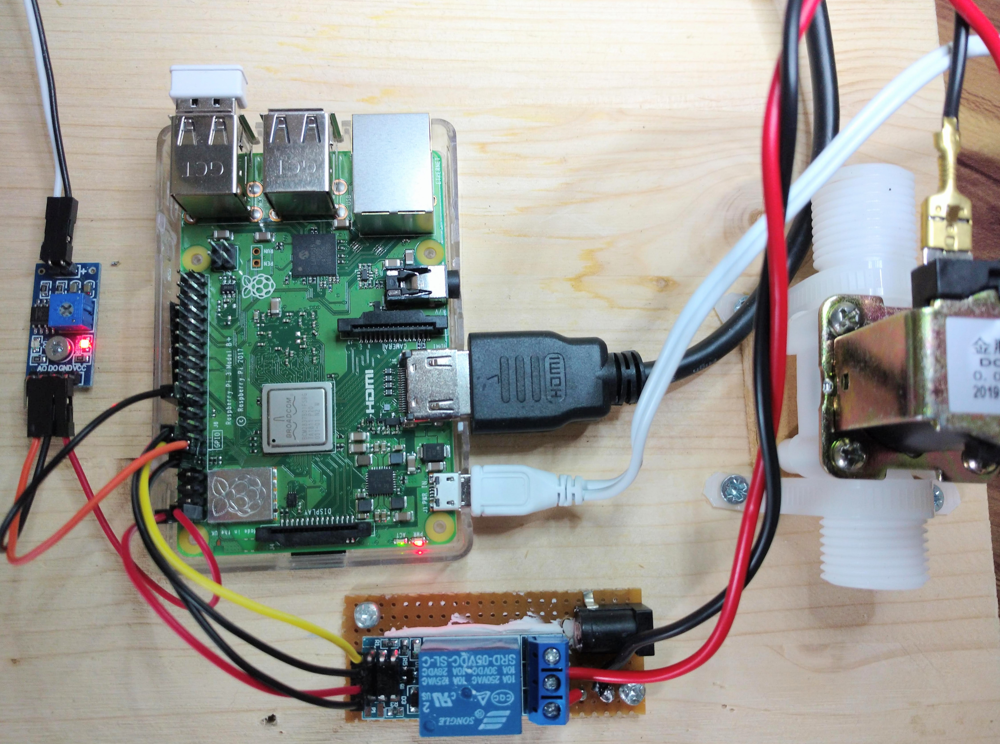

## Add the code for the moisture sensor
Duration: 2.00

The code for the moisture sensor can be added now:

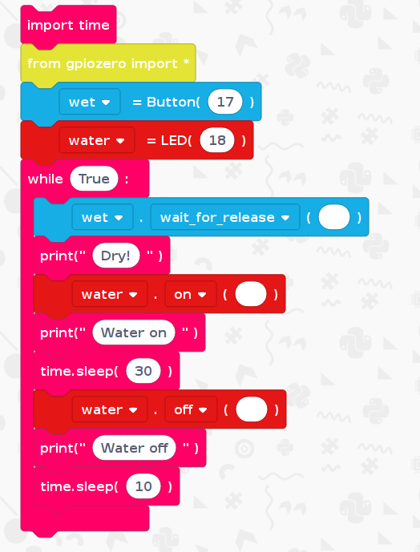

You will probably need to adjust the water valve's "on" and "off" times. This is to allow enough water to be fed to the plant when it's on, and to wait for a while after we switch the water off.

You can also adjust the moisture sensor's threshold (using a screw on the sensor board) to determine just how wet the soil will be when the waterer gets into a stable state.

## Connect the water supply
negative
: **Use some care here** - be aware that water must not come into contact with mains electricity!
Therefore it is strongly recommended to
a) use a **low-pressure** water supply (not a mains tap) and
b) **test the water system for leaks**.

For example, use:

* a small flat-sided bucket as your water reservoir
* a beer tap (Wilko) to connect the outlet hose.
 
Here's how I made the connections:

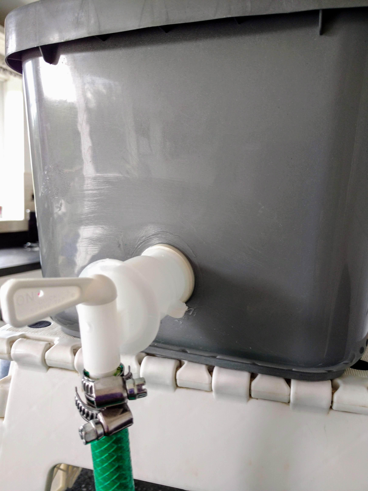

The green hose pipe connects to the input side of the valve.

At the output side of the valve I used a small diameter pipe and connector from a Micro Drip kit (search eBay!).

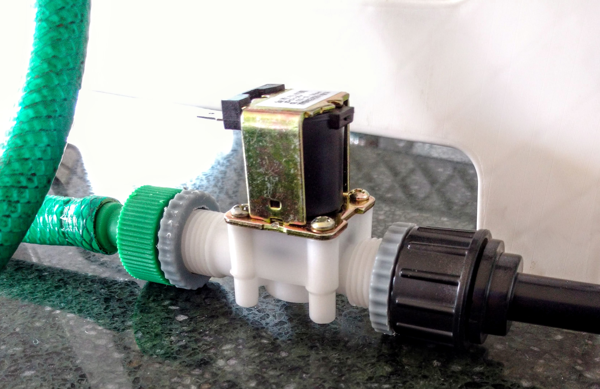

## (Optional) Print the time when the code "did things"
Duration: 5:00

positive
: This is an optional step: if you have time left then you could try adding the times when we **sense the soil is dry** and when we **switch the water on and off**.

Please take a look at the [Moisture sensor tutorial](https://learn.edublocks.org/tutorial/moisture-sensor#8) for some help with doing this.

---