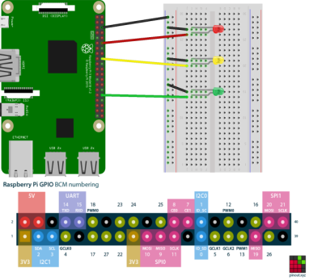
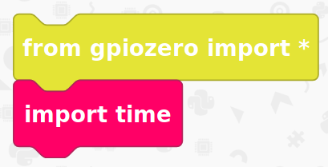

# Traffic Lights

## Overview

Within this tutorial we are going to create a simple circuit using 3 LEDs 1 x red, 1 x yellow and 1 x green. We are going to use EduBlocks and a Raspberry Pi to code and control the LEDs to simulate traffic lights.

You will need 
* An internet connection
* A setup Raspberry Pi with EduBlocks Connect or EduBlocks Desktop installed (Follow the guide on the [Raspberry Pi page](https://edublocks.org/pi.html) to learn more.)
* 1 x breadboard
* 1 x Red LED
* 1 x Yellow LED
* 1 x Green LED
* 3 x male to male jumper wires
* 4 x male to female jumper wires

## Get Started
Duration: 5:00

Once you've followed our Raspberry Pi getting started guide (if you haven't already done so), you'll want to launch EduBlocks connect. Go to the Raspberry Pi menu, select Programming and you'll see EduBlocks Connect Listed. Click on it to launch it. 

 

Now go back into the same menu, select Programming and launch Sonic Pi. This can take a few minutes to load, it is best not to click anywhere while this is
loading as it can crash the program.

You’ll now need to load up EduBlocks. You can do this by opening a web browser of your choice and typing [https://app.edublocks.org](https://app.edublocks.org) into the search box. Once you've loaded up EduBlocks, you'll be presented with the mode selector. 

 

Now, we want to select the mode. To do this simply click on the blue select button underneath the Raspberry Pi icon. This will load up the Raspberry Pi mode.
If you're on a raspberry pi, it will go straight to the mode if you have EduBlocks connect running. However, if you want to access this mode from a PC, you'll be given the option to connect to your Raspberry Pi by typing it it's IP Address.

Once you've selected the Raspberry Pi mode, you should see it pop up:

## Creating the circuit
Duration: 6:00

Now its time to build our traffic light circuit!

* Red LED = pin18
* Yellow LED = pin24
* Green LED = pin12

positive
: **NOTE:**
Each LED has 1 x long leg, which is the positive leg. This connects to the pins on the Raspberry Pi and 1 x short leg which connects to ground/negative. Within this tutorial the short legs connect to a common ground by connecting to the negative rail on the breadboard then one wire going from there to ground on the Raspberry Pi.

Once your circuit looks like the diagram above it's time to code.

## Setting up libraries
Duration: 3:00

1. Click on `gpiozero`
2. Click on `General`
3. Click and drag `from gpiozero import *` to the coding are and drop it there.
4. Click on `Basic`
5. Click and drag an `import time` block and attach it under `from gpiozero import *`

Your code should look like this:  

This imports Python Libraries. gpiozero helps us communicate with the GPIO pins on the Raspberry Pi and the time library lets us control pauses within the code.

### Setting up the pins
Duration: 6:00

1. Within the `gpiozero` menu click on `Outputs`
2. Click on `LED`
3. Click and drag an `led=LED()` to the code area and attach it under `from gpiozero import *`
4. Click on the arrow next to `led` and click on `Reanme variable` type `red` into the text box and click on OK.
5. Within the blank space between the `()` type `18` (this refers to the pin number that the red LED is connected to on the Raspberry Pi)
6. Click on `LED`
7. Click and drag an `led=LED()` block to the coding area and attach it under the `red=LED(18)` block.
8. Click on the small arrow next to `led` and click on `Rename variable` in the text box type `yellow` and click OK.
9. Within the blank space between `()` type `24` (this corresponds to the pin on the Raspberry Pi that the yellow LED is connected to)
10. Click on `LED`
11. Click and drag an `led=LED()` block to the code area and attach it under the `yellow=LED(24)`
12. Click on the small arrow next to `led` and click on `Rename variable` and type `green` into the text box and click OK.
13. Click within the blank space between `()` and type `12` (this refers to the pin on the Raspberry Pi where the green LED connects to)

Your code should now look like this:

.png)

### Create a loop
Duration: 1:00

1. Click on Basic
2. Click and drag a `while True:` block to the code area and attach it under the `green=LED(12)` block.

Your code should now look like this:

.png)

All code from now on will go inside the `while True:`. This will keep our code running forever simulating traffic lights.

### Turn the red LED on
Duration: 2:00

1. Click on `LED`
2. Click on an `led.on()` block to the coding area and attach it within the `while True:` block
3. Click on the small arrow next to `led` and click on `red`
4. Click on `Basic`
5. Click and drag a `time.sleep(1)` block to the code area and attach it under the `red.on()` block
6. Change the 1 to a 3

Your code should look like this:

.png)

This will turn the red LED on for 3 seconds.

### Turn the yellow LED on
Duration: 2:00

1. Click on `LED`
2. Click and drag an `led.on()` block to the code area and attach it under the `time.sleep(3)`
3. Click on the small arrow next to `led` and click on `yellow`
4. Click on `Basic`
5. Click and drag a `time.sleep(1)` block to the coding area and attach it under the `yellow.on()` block

Your code should now look like this:

.png)

The red LED is still on and the Yellow LED turns on for 1 second.

### Turning the red and yellow LEDs off and the green LED on
Duration: 2:00

1. Click on `LED`
2. Click and drag an `led.on()` block to the code area and attach it under the `time.sleep(1)` block
3. Click on the small arrow next to `led` and click on `red`
4. Click on the small arrow next to `on` and click on `off`
5. Click on `LED`
6. Click and drag an `led.on()` block to the code area and attach it under the `red.off()` block
7. Click on the small arrow next to `led` and click on `yellow`
8. Click on the small arrow next to `on` and click `off`
9. Click on `LED`
10. Click and drag an `led.on()` block to the code area and attach it under the `yellow.off()` block
11. Click on the small arrow next to `led` and click on `green`
12. Click on `Basic`
13. Click and drag a `time.sleep(1)` block to the code area and attach it under the `green.on()` block.
14. Change the 1 to a 3.

Your code should now look like this:

.png)

This turns the Red and Yellow LEDs off and turns the Green LED on for 3 seconds.

### Turn the yellow LED back on
Duration: 2:00

1. Click on `LED`
2. click and drag an `led.on()` block to the code area and attach it under `time.sleep(3)` block
3. Click on the small arrow next to `led` and click on `green`
4. Click on the small arrow next to `on` and click on `off`
5. Click on `LED`
6. Click and drag an `led.on()` block to the code area and attach it under `green.off()`
7. Click on the small arrow next to `led` and click on `yellow`
8. Click on `Basic`
9. Click and drag a `time.sleep(1)` block to the code area and attach it under `yellow.on()`

Your code should now look like this:

.png)

This turns the green LED off and the yellow LED back on for 1 second.

### Turn the yellow LED off
Duration: 1:00

1. Click on `LED`
2. Click and drag an `led.on()` block to the code area and attach it under the `time.sleep(1)` block
3. click on the small arrow next to `led` and click on `yellow`
4. Click on the small arrow next to `on` and click on `off`

Your code should now look like this:

.png)

Your code is now complete!

## Running the code
Duration: 1:00

You've now finished all of the code! It's time to check to see if we haven't missed a step or made a mistake. Now is your chance to check your code compared to the image below to check if it's all right.

## Run your code

Now it’s time to run our code. Click on the green run button in the top right hand corner of the EduBlocks window. You'll then see the LEDs flash in a traffic light sequence.

If you can't see the run button, click on the three lines menu icon and then select run.

