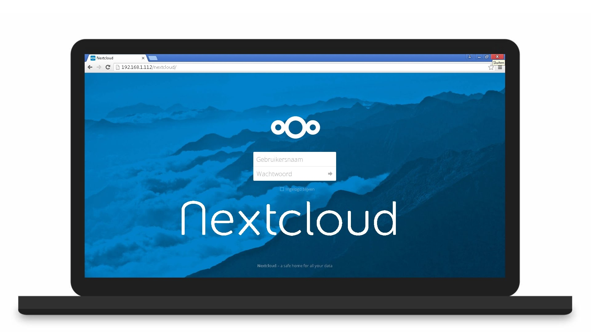
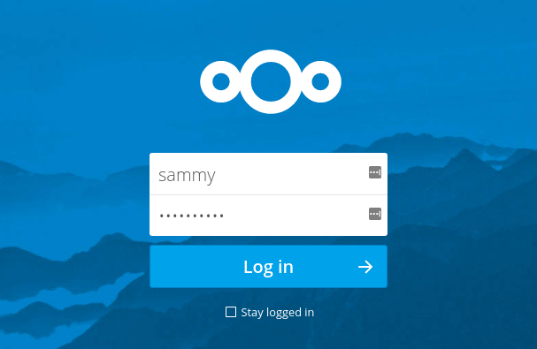
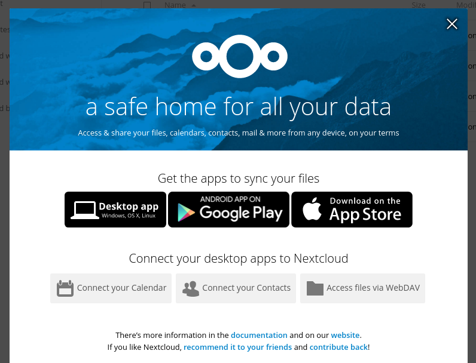
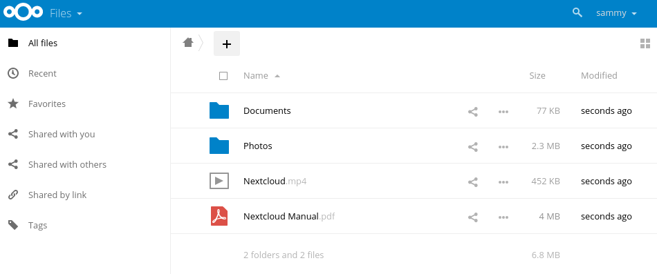

 ---
 id: Tutorial for installing NextCloud
 
 summary: A simple guide for installing and setting up NextCloud
 
 categories: Desktop
 
 tags: guide,write,contribute
 
 difficulty: 3
 
 status: Published
 
 feedback-url: https://github.com/canonical-websites/tutorials.ubuntu.com/issues
 
 author: Tanesh Chuckowree <arvesh1701@gmail.com>
 
 published: 2017-12-06
 
 ---
 
## Overview
 In this tutorial,we will be installing and setting up NextCloud which is functionaly similar to Dropbox although NextCloud is free and open-source,allowing anyone to  install and operate it on a private server.
 
 

## What you'll need

- Ubuntu Desktop 16.04 or above
- Some basic command-line knowledge

## This is the first step
Duration: 2:00

  For the first step,we will be installing NextCloud using the  snappy packaging system.This means that instead of installing and configuring a web and database server and then configuring the Nextcloud app to run on it, we can install the snap package which handles the underlying systems automatically.To do this enter the command below in the Terminal:
  
       `sudo snap install nextcloud`

   We can confirm that NextCloud has been successfully installed by entering the command below:
   
        `snap changes nextcloud`
        
   Which will give us something like that:
   
ID   Status  Spawn                 Ready                 Summary
2    Done    2017-10-03T20:03:09Z  2017-10-03T20:03:26Z  Install "nextcloud" snap

  
## This is the second step
Duration: 3:00
  
  Now that we have already given our username and password we will now be accessing  NextCloud through our server's domain name and password.
  
  OK so now we will be inputting our server's domain name by entering the command below:
  
       `sudo nextcloud.occ config:system:get trusted_domains`
       
   After that we will be securing our web interface with SSL-the standard security technology for establishing an encrypted link between a web server and a browser.
   
   In this case we will be using the easiest way to do this-we will set up SSL with a self-signed certificate.
   
   To do so we will enter the command below:
   
        `sudo nextcloud.enable-https self-signed`
        
    Which will generate a self-signed certificate for us,giving us an output like this
    
 `Output
Generating key and self-signed certificate... done
Restarting apache... done`

Now that we have secured our web interface we will be inputting the ports in our firewall to allow access to NextCloud.

            `sudo ufw allow 80,443/tcp`
            
            
## Third and last step
Duration: 3:00

Now that NextCloud has been fully configured we wiil be visiting our servers domain name.

       https://your-server's-domain-name.com
       
Since we have already input our username in the Terminal,we will be taken directly to the login page.

 
 
 Then as we already know,we click on the "log in" button,giving us something like this.
 
 
 
 After we will be taken to the cloud's main interface:
 
 
 
 And thats all....feel free to explore and get familiar with NextCloud..
 
 
#Thats all folks.
 
 

  
  
  
  
  
  
  
  
  
  
  
  
  
  
  
  
  
  
  
  
  
  
  
  
  
  
  
  

  
  
  

 
 
 
