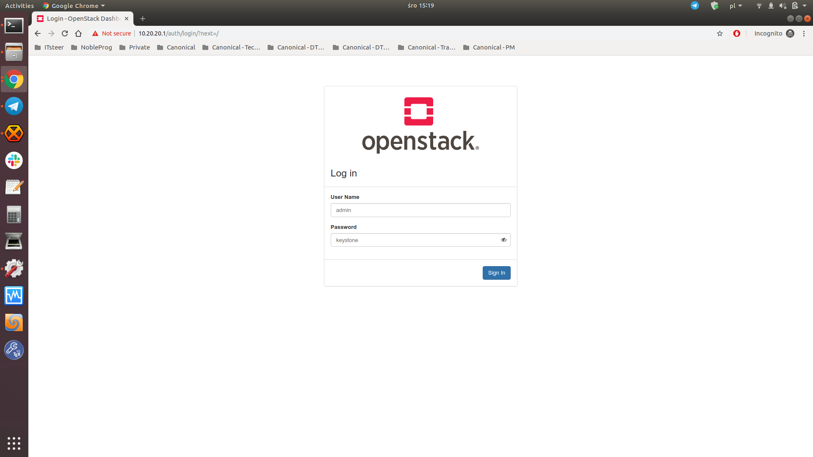
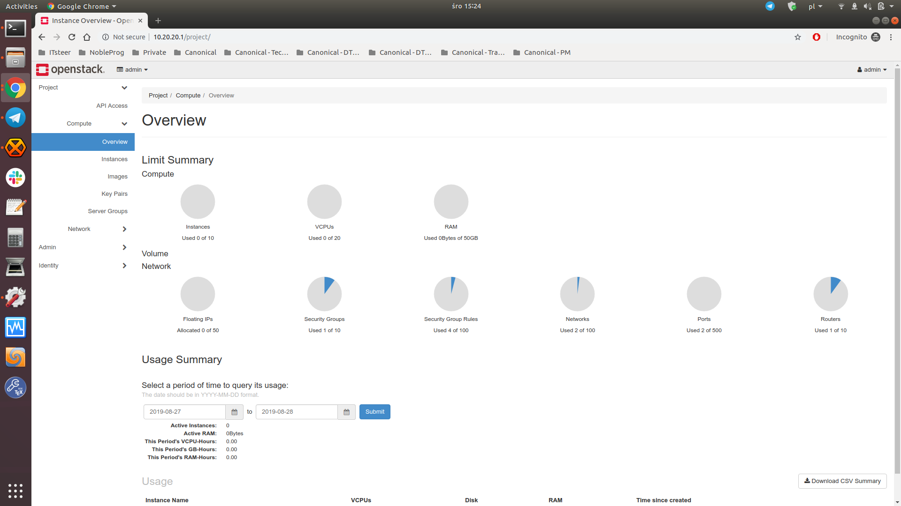
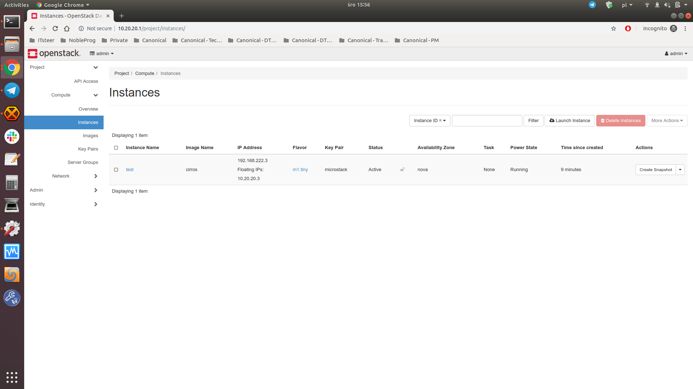

# Get started with MicroStack

## Overview

Duration: 1:00

### What is OpenStack?

[OpenStack][openstack-upstream] is a collection of open source projects designed to work together to form the basis of a cloud. OpenStack can be used for both private and public clouds.

### What is MicroStack?

[MicroStack][microstack] provides a single or multi-node OpenStack deployment which can run directly on your workstation. Although made for developers to prototype and test, it is also suitable for edge, IoT, and appliances.  MicroStack is an OpenStack in a [snap][snapcraft] which means that all OpenStack services and supporting libraries are packaged together in a single package which can be easily installed, upgraded or removed. MicroStack includes all key OpenStack components: Keystone, Nova, Neutron, Glance, and Cinder.

### In this tutorial you will learn how to:

- Get a single-node OpenStack cloud up and running with MicroStack
- Interact with OpenStack via the web GUI and CLI
- Launch your first VM on OpenStack and access it

### You will need:

* A machine running Linux, a multi-core processor and at least 8 GB of RAM

At time of writing, MicroStack has been assured to run bug-free only on Ubuntu 18.04 LTS.

## Install MicroStack

Duration: 2:00

Install MicroStack from the beta channel:

```bash
sudo snap install microstack --classic --beta
```

If you are using an older Ubuntu version or some other Linux distribution, you may have to install *snapd* first. Refer to [snapd documentation][snapcraft-snapd] for more information on installing *snapd* on your computer.

When the installation process has finished you should see the following message on the terminal:

```bash
microstack (beta) stein from Canonical✓ installed
```

Note that at the time of writing this tutorial, the installed version of OpenStack was Stein.

Being a snap, MicroStack is published in channels which are made up of a track (or a major version), and an expected level of stability. You can run `snap info microstack` command to see which versions are currently available.

positive
: **OpenStack releases**
MicroStack snap versions and channels do not correspond to the OpenStack release that will be installed.

## Initialize MicroStack

Duration: 10:00

MicroStack needs to be initialised, so that networks and databases get configured. To do this, run:

```bash
sudo microstack.init --auto
```

Once this completes (10 - 15 minutes) your OpenStack cloud will be up and running!

## Interact with OpenStack

Duration: 4:00

### via web GUI

To interact with your cloud via the web GUI visit <http://10.20.20.1/> and log in with the following credentials:

```bash
username: admin
password: keystone
```

Type the credentials and press the "Sign In" button:



If everything goes fine you should see the landing page:



You can now start playing with your OpenStack installation (i.e. create additional users, launch instances, etc.).

### via CLI

You can also interact with your OpenStack cloud via the CLI by using the `microstack.openstack` command. The syntax is identical to the client delivered by the [python-openstackclient][openstack-client] package.

For example, to list available OpenStack endpoints run:

```bash
microstack.openstack catalog list
```

You can run `microstack.openstack --help` to get a list of available subcommands and their required syntax.

## Launch and access a VM

Duration: 5:00

### Test launch

To launch your first OpenStack instance (VM) called "test" based on the CirrOS image, run the following:

```bash
microstack.launch cirros --name test
```

The last two lines of the resulting output are the most important:

```bash
Access your server with 'ssh -i $HOME/.ssh/id_microstack <username>@10.20.20.3'

You can also visit the openstack dashboard at 'http://10.20.20.1/'
```

Note that the IP address of the instance may be different in your environment. In order to connect to the instance run the command from the output. Since the CirrOS image was used the username is 'cirros':

```bash
ssh -i $HOME/.ssh/id_microstack cirros@10.20.20.3
```

Now that you are connected to the instance you can use normal Linux commands. Note that the CirrOS image provides a minimalist operating system! For example:

```bash
$ uptime
 14:51:42 up 4 min,  1 users,  load average: 0.00, 0.00, 0.00
```

To disconnect from the instance, type `exit` (or `Ctrl-d`).

You can also view the instance from the web GUI. Go to http://10.20.20.1/ and click on the "Instances" tab on the left:



### Next steps

The `microstack.openstack` command provides the same functionality as the upstream OpenStack client. This means you can use the same commands as on any other OpenStack installation.

MicroStack comes preconfigured with networking, an image, flavors, opened security groups (TCP port 22 and ICMP), and an SSH keypair. Use the above client command to view these things as you normally would. The launch command can even be replaced by the client command (`microstack.openstack server create`). You will need to handle floating IP addresses manually though.

Learn more by reading the [MicroStack documentation][microstack-docs]. The clustering feature is particularly interesting.

## That’s all folks!

Duration: 1:00

Congratulations! You have made it!

You may wish to temporarily disable your MicroStack installation when not in use. To do so, run:

```bash
sudo snap disable microstack
```

To re-enable it, run:

```bash
sudo snap enable microstack
```

### Where to go from here?

* Something broken? [Report a bug][microstack-bugs]
* Liked snaps? Try [MicroK8s][microk8s]
* Install OpenStack with Juju: [Charmed OpenStack][openstack-charmed]

<!-- LINKS -->

[microk8s]: https://microk8s.io/
[microstack]: https://microstack.run/
[microstack-docs]: https://microstack.run/docs
[microstack-bugs]: https://bugs.launchpad.net/microstack/+filebug
[openstack-charmed]: https://jaas.ai/openstack-base/bundle/
[openstack-client]: https://docs.openstack.org/python-openstackclient/latest/cli/command-list.html
[openstack-upstream]: https://www.openstack.org/
[snapcraft]: https://snapcraft.io/
[snapcraft-snapd]: https://snapcraft.io/docs/installing-snapd
