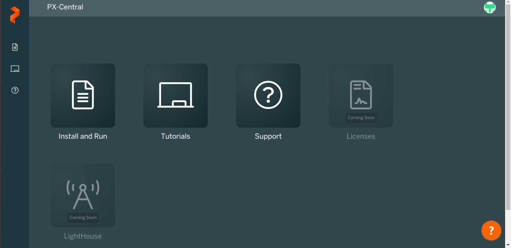
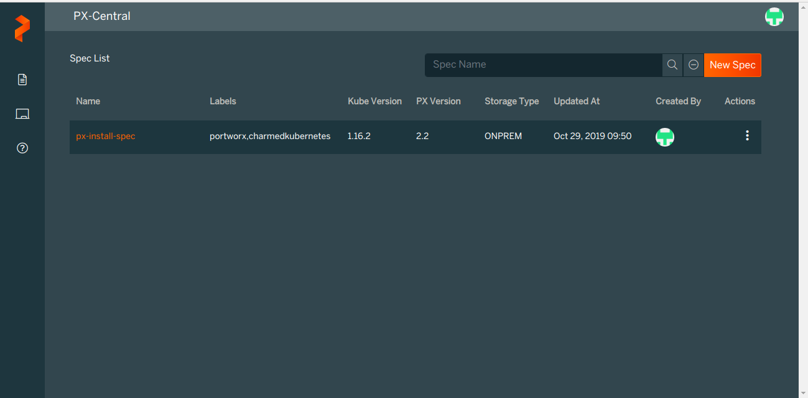
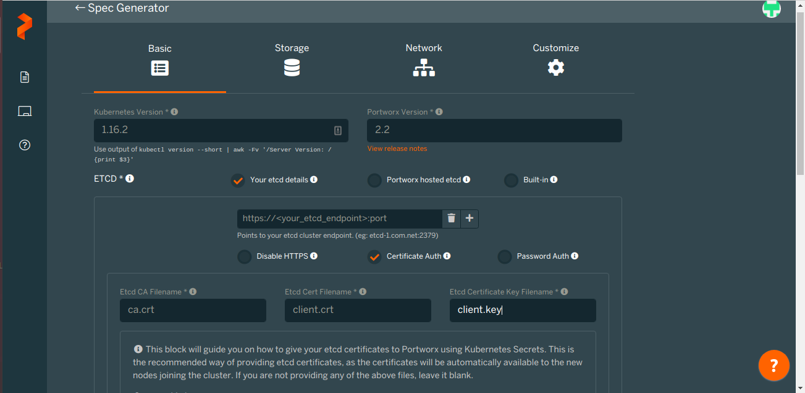
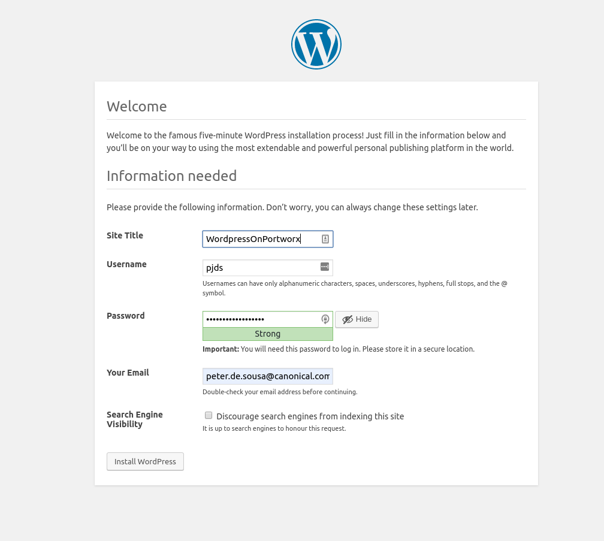
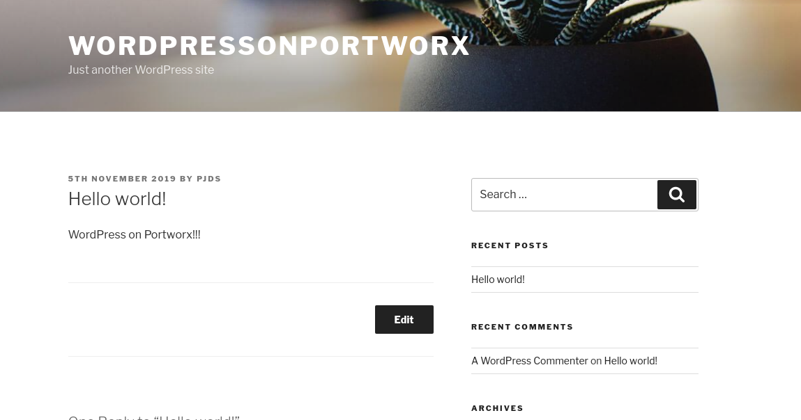

# Introduction
Duration: 2

Kubernetes offers a range of storage solutions out of the box, but the majority of these are specific to cloud providers, for example, AWS or Google Cloud. This means that the options left for bare metal deployments are Ceph, NFS or local.

# Before you start
Duration: 15

## Create a Portworx Account

Before you can get started you will first need to create a Portworx account once you have done this you can go ahead and create a new spec. To do this, firstly launch the Install and Run wizard in Portworx Central.



Once logged in, use the Install and Run Wizard.




When setting up the wizard for  Charmed Kubernetes we will also need the etcd deployment certificates.

These can be acquired by running the following commands.

```
juju run-action --wait etcd/0 package-client-credentials
juju scp etcd/0:etcd_credentials.tar.gz etcd_credentials.tar.gz
tar -xvf ./etcd_credentials.tar.gz
```

Once acquired, the names should match the names in the wizard, in addition the endpoints of etcd within Charmed Kubernetes need to be used. To get these endpoints you can run the following juju commands.

```
juju status etcd | awk '{print $3}' | tail -n 4
```

Once this is complete, your wizard should look similar to mine.



# Setting up secrets
Duration: 5

Portworx uses etcd as it’s metadata store, for it to be able to communicate with etcd it will need the certificates that you packaged in the last step.

Portworx reads this certificates directly from Kubernetes Secrets so you must create them.

```
kubectl -n kube-system create secret generic px-kvdb-auth --from-file=etcd_credentials/
kubectl -n kube-system get secrets
```

# Setting Up
Duration: 10

Create the portworx deployment, this will create all the deployments and other resources needed to install the portworx install.

```
kubectl create -f px-install-spec.yaml
```

## Pods
When setting up Portworx the setup is reminiscent of [StorageOS](https://ubuntu.com/blog/how-to-deploy-storageos-on-charmed-kubernetes), being very easy and the YAML is even generated for you.

At the time of writing that was one issue though, this was that the generated YAML from the Portworx website is not updated for Charmed Kubernetes 1.16.

```
kube-system portworx-2sb8q      0/1          ContainerCreating   0          9s
kube-system portworx-9dkpk      0/1          ContainerCreating   0          9s
kube-system portworx-api-cbf7j  0/1          ContainerCreating   0          9s
kube-system portworx-api-mqdrj  0/1          ContainerCreating   0          9s
kube-system portworx-api-pfkb4  0/1          ContainerCreating   0          9s
kube-system portworx-f9gh4      0/1          ContainerCreating   0          9s
kube-system px-lighthouse…      0/3          Init:0/1            0          9s
kube-system stork-556946b…      0/1          ContainerCreating   0          9s
kube-system stork-556946b…      0/1          ContainerCreating   0          9s
kube-system stork-556946b…      0/1          ContainerCreating   0          9s
kube-system stork-schedul…      0/1          ContainerCreating   0          9s
kube-system stork-schedul…      0/1          ContainerCreating   0          9s
kube-system stork-schedul…      0/1          ContainerCreating   0          9s
```

## Create a Storage Class
Before you can use the new Portworx deployment you will first need to create a StorageClass, for this we can use the StorageClass from the Portworx docs [1]

```
kubectl create -f - <<END
kind: StorageClass
apiVersion: storage.k8s.io/v1
metadata:
  name: portworx-sc
provisioner: kubernetes.io/portworx-volume
parameters:
  repl: "1"
END
```

You can the check the StorageClass by running:

```
kubectl describe storageclass portworx-sc
```

Now you can create a PVC and test the new deployment out.

```
kc create -f - <<END
apiVersion: v1
kind: PersistentVolumeClaim
metadata:
  name: myfirstpvcinpx
  annotations:
    volume.beta.kubernetes.io/storage-class: portworx-sc
spec:
  accessModes:
    - ReadWriteOnce
  resources:
    requests:
      storage: 5Gi
END
```
```

NAME      STATUS   VOLUME             CAPACITY   ACCESS MODES   STORAGECLASS   AGE
ceph-vol2 Bound    pvc-8a5d855f-...   5Gi        RWO            ceph-xfs       57m
myfirst…  Bound    pvc-2daeef64-...   5Gi        RWO            portworx-sc    25s
```

Like with previous blog posts, let's put a workload on our deploy, using the classic MySqlWordpress Website:

## Deploying a Wordpress and MySQL workload on Portworx

Using the kustomization found here you can create a Wordpress/MySQL deployment which uses the portworx as it’s storage class.

Check the PVCs have been created.

```
NAME      STATUS    VOLUME    CAPACITY   ACCESS MODES   STORAGECLASS   AGE
[mysql…]   Bound    [pvc-...]   20Gi       RWO            fast           7m7s
[wp…]      Bound    [pvc-...]   20Gi       RWO            fast           7m7s
```

## Access the site using NodePort

First you need a NodeIP, use any of the IPs returned.

```
kubectl get node --selector='!node-role.kubernetes.io/master' -o wide | awk '{print $6}' | tail -n 3
```

Find the port which our service is running on within our cluster:

```
kubectl get svc
```

The output you get back should be something like below:

```
NAME          TYPE           CLUSTER-IP       EXTERNAL-IP   PORT(S)        AGE
Csi-rbd…      ClusterIP      10.152.183.198   <none>        12345/TCP      76m
Csi-rbd…      ClusterIP      10.152.183.112   <none>        12345/TCP      76m
kubernetes    ClusterIP      10.152.183.1     <none>        443/TCP        139m
wordpress    LoadBalancer   10.152.183.148   <pending>     80:32132/TCP   39s
wordpress…   ClusterIP      None             <none>        3306/TCP       39s
```

If your charmed Kubernetes distribution isn’t using a Load Balancer we can just use the node port to access the service instead, like so:

```
http://K8SWORKER_IP:32132/2019/11/01/hello-world/
```

*Note* that your node port will almost certainly be different.

Once you have selected a language you can go ahead, create an account.


Once you have done this, go ahead and play around, for this blog post I edited the “Hello World” page.



And you have a working WordPress site!

## That's all folks!

Congratulations! In this tutorial, you deployed Portworx on Charmed Kubernetes and created a WordPress site which used Portworx as it's storage backend.

This tutorial can be adapted for other tasks which require persistent volumes and shows you the ease of using a solution such as Portworx offers.

### Where to go from here?
- Explore [Charmed Kubernetes](https://jaas.ai/kubernetes)
- Use Kubernetes straight away for free with [MicroK8s](https://microk8s.io/)
- Looking for production-grade [Kubernetes?](https://ubuntu.com/kubernetes/contact-us)
- Portworx [docs](https://docs.portworx.com/)
