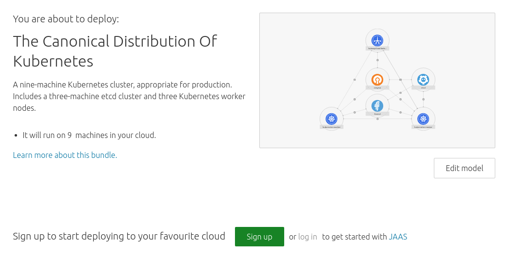
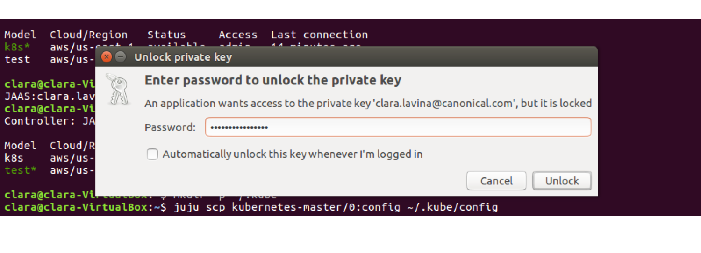
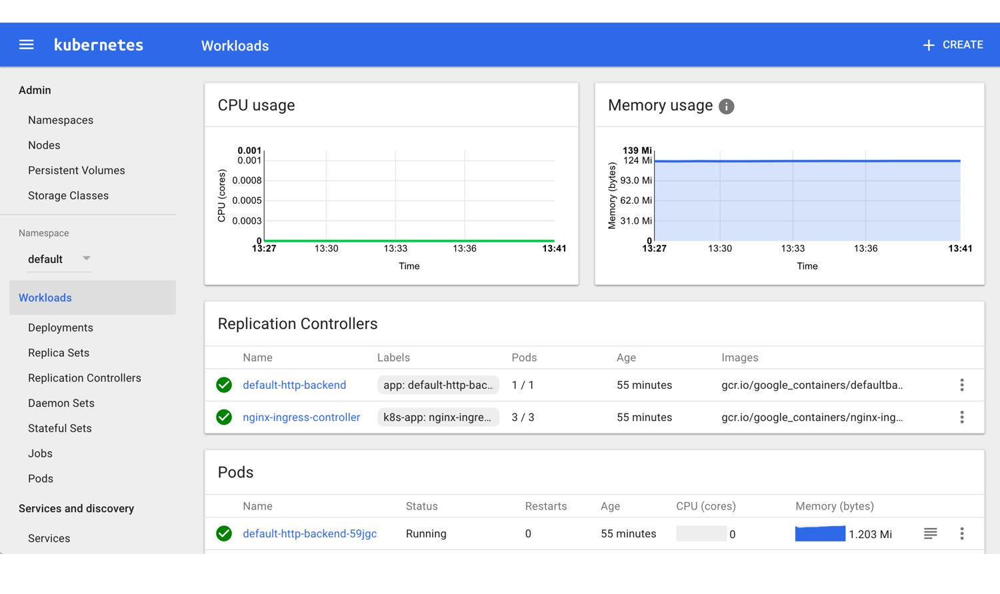
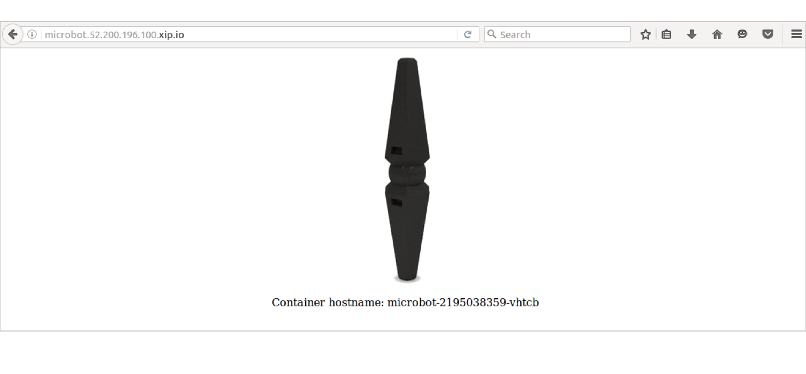

# Get started with Charmed Kubernetes

## Overview
Duration: 1:00

[Kubernetes][kubernetes] fuses the automatic deployment, scaling and management of containerised applications into a single platform. It is open source and rapidly growing in capabilities, reputation and influence.

The [Charmed Kubernetes][canonicalkubernetes] packages Canonical's operational expertise alongside the same upstream binaries as Kubernetes, making it easily re-deployable across public clouds (AWS, GCE, Azure or Rackspace), private infrastructure (OpenStack, VMware), and even bare metal - from your laptop to the lab.

### About the Charmed Kubernetes

To substantiate these claims, we are going to build a highly available (HA) production ready Kubernetes cluster — with 2 masters, 3 workers, 3 etcd nodes and a load balancer for the HA control plane. It includes logging, monitoring, scaling and the operational tools to automate deployment and lifecycle management of your cluster.

### In this tutorial you’ll learn how to...

- Get your Kubernetes cluster up and running
- Open the K8s dashboard
- Control your cluster from the kubectl CLI client
- Deploy your first container workload
- Add extra features to your Kubernetes cluster

### You will need...

* An [Ubuntu One account][ubuntuone]
* An SSH key. [More on using SSH keys in Juju][sshkey].
* Credentials for either [AWS][aws], [GCE][gce] or [Azure][azure]

## Deploy Charmed Kubernetes with JAAS
Duration: 8:00

To kick off the deployment, **[open a Charmed Kubernetes at JAAS][charmstorek8s]**.

The deployment is made via [JAAS][jaas] - Juju-as-a-Service solution from Canonical. You will need to login or create JAAS account. [Add your credentials][jaascreds] if you have not done so before. The deployment will then take several minutes, as Juju creates new instances in the cloud and sets up the Kubernetes cluster components. Pending units are outlined in *orange*. Up and running ones are outlined in *black*.

## Install client software
Duration: 3:00

### Install the Juju client

**In order to operate the deployment you will need to have Juju client installed locally. Skip this step, if you already have it.**

Juju client is available on many platforms and distributions. If you are running **Ubuntu**, you can install Juju client by running the following command:
`sudo snap install juju --classic`

If you are using other **Linux** distribution, you have to install snapd first. Refer to [Snapd documentation][snapd] for more information on installing snapd on your Linux distribution.

If you are using other OS than Linux, such as **macOS** or **Windows**, refer to [Juju documentation][jujuinstall].

Verify that you can run *juju* command. You will see a list of commands to control your Juju cluster.
`juju`

Learn more about Juju by visiting the [official documentation][jujustarted].

### Install the Kubernetes client

**In order to deploy and manage applications on Kubernetes you will need *kubectl* client installed locally. Skip this step, if you already have it.** 

Kubectl is available on many platforms and distributions. If you are running **Ubuntu**, you can install kubectl by running the following command:
`sudo snap install kubectl --classic`

If you are using other **Linux** distribution, you have to install snapd first. Refer to [Snapd documentation][snapd] for more information on installing snapd on your Linux distribution.

If you are using **macOS**, run:
`brew install kubectl`

If you are using **Windows**, use [Chocolatey][chocolatey]:
`choco install kubectl`

Verify that you can run *kubectl* command. You will see a list of commands to control your Kubernetes cluster.
`kubectl`

Learn more about kubectl by visiting the [official documentation][kubectl].

## Operate your cluster
Duration: 7:00

To operate your cluster with kubectl you need to download the configuration needed to speak to your cluster. The first step to getting the config is to make sure you have an SSH key in your JAAS deployment of your cluster.

1. To connect to JAAS from the command line you will need to register with the JAAS controller. You will only need to do this the first time:
`juju register jimm.jujucharms.com`
1. This command will open a new window in your browser. Use Ubuntu SSO to login and authorise your account.
1. You will then be asked to enter a descriptive name for the JAAS controller. We suggest using *jaas*.
1. You can now import your SSH key from Launchpad or Github into your cluster (if you did not add it earlier). For instance, a user with the Github username *ghuser* would use the following command:
`juju import-ssh-key gh:ghuser`
1. Verify your SSH key is working by running the *date* command on the first machine:
`juju run --machine 0 -- date`
With SSH operating properly you can now setup *kubectl*.
1. Fetch the credentials from the Kubernetes master node:
Make a directory:
`mkdir -p ~/.kube`
and then copy the config file:
`juju scp kubernetes-master/0:config ~/.kube/config`
This might open a separate modal window, in which you should enter the passphrase for your SSH key you added in step 4:

1. Establish a secure proxy to the Kubernetes apiserver with the following command:
`kubectl proxy`

1. Navigate to the Kubernetes dashboard UI through the proxy **http://xxx.xxx.xxx.xxx:8001/ui**. Note the trailing `/ui`:

_**Note**: The browser may warn you that the connection is not private or secure. Bypass the warnings (via the ‘Advanced’) option. The browser will then ask you to login. The default username and password are both **admin**._

1. You can now use the Kubernetes Dashboard to drive your cluster:

## Run your first workload
Duration: 10:00

Spin up a simple static website in your Kubernetes cluster.

1. You can run a charm action to create an example microbot web application, deploying 5 replicas inside the Kubernetes cluster:
`juju run-action kubernetes-worker/0 microbot replicas=5`
1. This action creates a deployment titled *microbots* comprised of 5 replicas defined during the run of the action. It also creates a service named *microbots* which binds an *endpoint*, using all 5 of the microbots pods. Finally, it will create an ingress resource, which points at a **xip.io** domain to simulate a proper DNS service
1. To see the result of this action, run:
 `juju show-action-output [id above]`
You should get a similar response to:

_**Note**: Your FQDN will be different and contains the address of the cloud instance._

1. Copy and paste the microbot address into your web browser: **microbot.xxx.xxx.xxx.xip.io**. It is normal to see a 502 / 503 errors during initial application turnup.

1. You have successfully connected to a microbot container! Within a few seconds your microbot example application will be online, and load balanced across the 5 pods running the microbot application. Refresh and the hostname at the bottom should change with each request

To learn more about this, go to the *Running the packaged example* section in the [bundle details][canonicalkubernetes].

## That’s all folks!
Duration: 1:00

Congratulations! You have made it!

By now you should have your Kubernetes cluster up and running.

### Next steps

Now that you have your production cluster, you can put it to work:

* [The easy way to commoditise GPUs for Kubernetes][kubegpu]
* [Build a transcoding platform in minutes][kubetransform]
* [Transform your solution into a private PaaS][kubepaas]

### Further reading

* Experiment with the [Charmed Kubernetes][canonicalkubernetes] bundle
* Learn more about [Charmed Kubernetes][cankube]
* Discover Kubernetes opportunities with [Canonical][ubuntukubernetes]
* Try [MicroK8s][microk8s]
* Contact [us][contact]

<!-- LINKS -->
[sshkey]: https://jaas.ai/docs/machine-auth
[ubuntuone]: https://login.ubuntu.com/
[canonicalkubernetes]: https://jaas.ai/canonical-kubernetes
[kubernetes]: https://kubernetes.io/
[aws]: https://aws.amazon.com/
[gce]: https://cloud.google.com/compute/
[azure]: https://azure.microsoft.com
[charmstorek8s]: https://jujucharms.com/new/?dd=cs:bundle/canonical-kubernetes
[jaas]: https://jujucharms.com/jaas
[jaascreds]: https://jujucharms.com/docs/stable/getting-started#prepare-your-cloud-credentials
[jujuinstall]: https://jaas.ai/docs/installing
[jujustarted]: https://jujucharms.com/docs/stable/getting-started
[kubectl]: https://kubernetes.io/docs/user-guide/kubectl/
[kubectlinstall]: https://kubernetes.io/docs/tasks/tools/install-kubectl/
[chocolatey]: https://chocolatey.org/install
[kubegpu]: https://medium.com/intuitionmachine/how-we-commoditized-gpus-for-kubernetes-7131f3e9231f
[kubetransform]: https://github.com/deis/workflow
[kubepaas]: https://insights.ubuntu.com/2017/03/27/job-concurrency-in-kubernetes-lxd-cpu-pinning-to-the-rescue/
[cankube]: https://jujucharms.com/kubernetes
[kubecommunity]: https://kubernetes.io/community/
[snapcraft]: https://snapcraft.io/
[kubecurl]: https://kubernetes.io/docs/tasks/tools/install-kubectl/#install-kubectl-binary-via-curl
[snapd]: https://snapcraft.io/docs/installing-snapd
[microk8s]: https://tutorials.ubuntu.com/tutorial/install-a-local-kubernetes-with-microk8s#0
[ubuntukubernetes]: https://ubuntu.com/kubernetes
[contact]: https://ubuntu.com/kubernetes#get-in-touch
