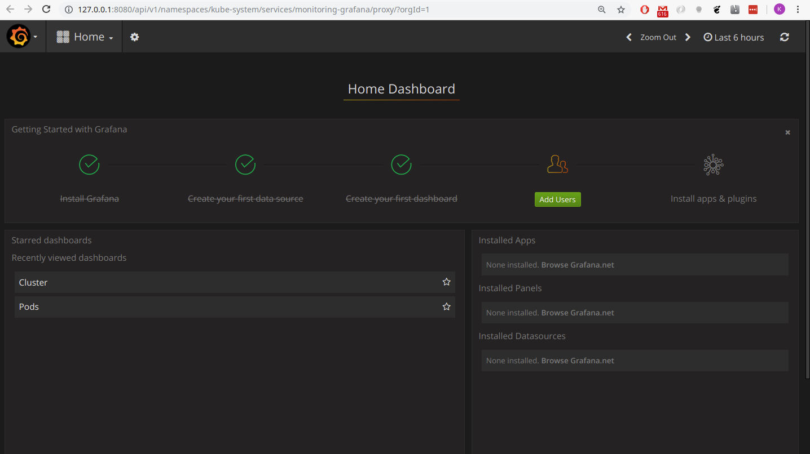
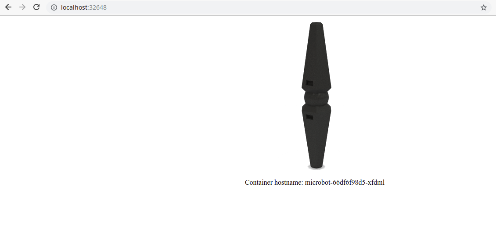

# Install a local Kubernetes with MicroK8s

## Overview

### What is Kubernetes

[Kubernetes][kubernetes] clusters host containerised applications in a reliable and scalable way. Having DevOps in mind, Kubernetes makes maintenance tasks such as upgrades dead simple.


### What is MicroK8s

[MicroK8s][microk8s] is a [CNCF certified][cncf-cert] upstream Kubernetes deployment that runs entirely on your workstation or edge device. Being a [snap][snap] it runs all Kubernetes services natively (i.e. no virtual machines) while packing the entire set of libraries and binaries needed. Installation is limited by how fast you can download a couple of hundred megabytes and the removal of MicroK8s leaves nothing behind.

### In this tutorial you’ll learn how to...

- Get your Kubernetes cluster up and running
- Enable core Kubernetes addons such as dns and dashboard
- Control your cluster from the kubectl CLI client
- Deploy your first container workload

### You will only need ...

* A machine with Linux


## Deploying MicroK8s
Duration: 3:00

If you are using Ubuntu, the quickest way to get started is to install MicroK8s directly from the [snap store][microk8s-snap] by clicking the "Install" button.
 
However, you can also install MicroK8s from the command line:

```bash
sudo snap install microk8s --classic
```

If you are using other Linux distribution, you have to install snapd firt. Refer to [Snapd documentation][snapd-documentation] for more information on installing snapd on your Linux distribution.

[MicroK8s][microk8s] is a snap and as such it is frequently updated to each release of Kubernetes. To follow a specific upstream release series we can select a [channel][snap-channels] during installation. For example, to follow the v1.15 series:

```bash
sudo snap install microk8s --classic --channel=1.15/stable
```

Channels are made up of a track and an expected level of MicroK8s' stability. Try `snap info microk8s` to see what versions are currently published. At the time of this writing we have:
```bash
channels:
  stable:         v1.15.2         2019-08-05 (743) 192MB classic
  candidate:      v1.15.2         2019-08-05 (743) 192MB classic
  beta:           v1.15.2         2019-08-05 (743) 192MB classic
  edge:           v1.15.2         2019-08-08 (762) 171MB classic
  1.16/stable:    –                                      
  1.16/candidate: –                                      
  1.16/beta:      –                                      
  1.16/edge:      v1.16.0-alpha.2 2019-08-02 (733) 193MB classic
  1.15/stable:    v1.15.2         2019-08-06 (745) 192MB classic
  1.15/candidate: v1.15.2         2019-08-06 (745) 192MB classic
  1.15/beta:      v1.15.2         2019-08-06 (745) 192MB classic
  1.15/edge:      v1.15.2         2019-08-08 (763) 171MB classic
  1.14/stable:    v1.14.5         2019-08-06 (744) 217MB classic
  1.14/candidate: v1.14.5         2019-08-06 (744) 217MB classic
  1.14/beta:      v1.14.5         2019-08-06 (744) 217MB classic
  1.14/edge:      v1.14.5         2019-08-05 (744) 217MB classic
  1.13/stable:    v1.13.6         2019-06-06 (581) 237MB classic
  1.13/candidate: v1.13.6         2019-05-09 (581) 237MB classic
  1.13/beta:      v1.13.6         2019-05-09 (581) 237MB classic
  1.13/edge:      v1.13.7         2019-06-06 (625) 244MB classic
  1.12/stable:    v1.12.9         2019-06-06 (612) 259MB classic
  1.12/candidate: v1.12.9         2019-06-04 (612) 259MB classic
  1.12/beta:      v1.12.9         2019-06-04 (612) 259MB classic
  1.12/edge:      v1.12.9         2019-05-28 (612) 259MB classic
  1.11/stable:    v1.11.10        2019-05-10 (557) 258MB classic
  1.11/candidate: v1.11.10        2019-05-02 (557) 258MB classic
  1.11/beta:      v1.11.10        2019-05-02 (557) 258MB classic
  1.11/edge:      v1.11.10        2019-05-01 (557) 258MB classic
  1.10/stable:    v1.10.13        2019-04-22 (546) 222MB classic
  1.10/candidate: v1.10.13        2019-04-22 (546) 222MB classic
  1.10/beta:      v1.10.13        2019-04-22 (546) 222MB classic
  1.10/edge:      v1.10.13        2019-04-22 (546) 222MB classic
```


positive
: You may need to configure your firewall to allow pod-to-pod and pod-to-internet communication:
  (192.168.1.xx should be substituted for the master node ip address) 
```
sudo ufw allow in on cni0 && sudo ufw allow out on cni0
sudo ufw default allow routed
sudo ufw allow in on eth0 from 192.168.1.xx to any proto tcp port 10255
sudo ufw allow in on eth0 from 192.168.1.xx to any proto tcp port 25000
```


## Enable addons
Duration: 2:00

By default we get a barebones upstream Kubernetes. Additional services, such as dashboard or kube-dns, can be enabled by running the `microk8s.enable` command:
```bash
microk8s.enable dashboard dns
```

These addons can be disabled at anytime by running the `microk8s.disable` command:
```bash
microk8s.disable dashboard dns
```

With `microk8s.status` you can see the list of available addons and the ones currently enabled.

### List of the most important addons
 - dns: Deploy DNS. This addon may be required by others, thus we recommend you always enable it.
 - dashboard: Deploy kubernetes dashboard as well as grafana and influxdb.
 - storage: Create a default storage class. This storage class makes use of the hostpath-provisioner pointing to a directory on the host.
 - ingress: Create an ingress controller.
 - gpu: Expose GPU(s) to MicroK8s by enabling the nvidia-docker runtime and nvidia-device-plugin-daemonset. Requires NVIDIA drivers to be already installed on the host system.
 - istio: Deploy the core Istio services. You can use the `microk8s.istioctl` command to manage your deployments.
 - registry: Deploy a docker private registry and expose it on localhost:32000. The storage addon will be enabled as part of this addon.


## Accessing the Kubernetes and grafana dashboards
Duration: 8:00

Now that we have enabled the dns and dashboard addons we can access the available dashboard. To do so we first check the deployment progress of our addons with `microk8s.kubectl get all --all-namespaces`. It only takes a few minutes to get all pods in the "Running" state:
```
> microk8s.kubectl get all --all-namespaces
NAMESPACE     NAME                                                  READY   STATUS    RESTARTS   AGE
kube-system   pod/coredns-f7867546d-zb9t5                           1/1     Running   0          3m25s
kube-system   pod/heapster-v1.5.2-844b564688-5bpzs                  4/4     Running   0          64s
kube-system   pod/kubernetes-dashboard-7d75c474bb-jcglw             1/1     Running   0          3m19s
kube-system   pod/monitoring-influxdb-grafana-v4-6b6954958c-nc6bq   2/2     Running   0          3m19s


NAMESPACE     NAME                           TYPE        CLUSTER-IP       EXTERNAL-IP   PORT(S)                  AGE
default       service/kubernetes             ClusterIP   10.152.183.1     <none>        443/TCP                  3m34s
kube-system   service/heapster               ClusterIP   10.152.183.7     <none>        80/TCP                   3m19s
kube-system   service/kube-dns               ClusterIP   10.152.183.10    <none>        53/UDP,53/TCP,9153/TCP   3m25s
kube-system   service/kubernetes-dashboard   ClusterIP   10.152.183.64    <none>        443/TCP                  3m19s
kube-system   service/monitoring-grafana     ClusterIP   10.152.183.3     <none>        80/TCP                   3m19s
kube-system   service/monitoring-influxdb    ClusterIP   10.152.183.203   <none>        8083/TCP,8086/TCP        3m19s


NAMESPACE     NAME                                             READY   UP-TO-DATE   AVAILABLE   AGE
kube-system   deployment.apps/coredns                          1/1     1            1           3m25s
kube-system   deployment.apps/heapster-v1.5.2                  1/1     1            1           3m19s
kube-system   deployment.apps/kubernetes-dashboard             1/1     1            1           3m19s
kube-system   deployment.apps/monitoring-influxdb-grafana-v4   1/1     1            1           3m19s

NAMESPACE     NAME                                                        DESIRED   CURRENT   READY   AGE
kube-system   replicaset.apps/coredns-f7867546d                           1         1         1       3m25s
kube-system   replicaset.apps/heapster-v1.5.2-6b794f77c8                  0         0         0       3m19s
kube-system   replicaset.apps/heapster-v1.5.2-6f5d55456                   0         0         0       84s
kube-system   replicaset.apps/heapster-v1.5.2-844b564688                  1         1         1       64s
kube-system   replicaset.apps/kubernetes-dashboard-7d75c474bb             1         1         1       3m19s
kube-system   replicaset.apps/monitoring-influxdb-grafana-v4-6b6954958c   1         1         1       3m19s
```

### Kubernetes dashboard

As we see above the kubernetes-dashboard service in the kube-system namespace has a ClusterIP of `10.152.183.64` and listens on TCP port `443`. The ClusterIP is randomly assigned, so if you follow these steps on your host, make sure you check the IP adress you got. Point your browser to `https://10.152.183.64:443` and you will see the kubernetes dashboard UI. To access the dashboard use the default token retrieved with:

```
token=$(microk8s.kubectl -n kube-system get secret | grep default-token | cut -d " " -f1)
microk8s.kubectl -n kube-system describe secret $token
```


### Grafana dashboard

Let's use an alternative approach to access hosted services. The API server proxies our services, here is how to get to them:
```bash
> microk8s.kubectl cluster-info
Kubernetes master is running at https://127.0.0.1:16443
Heapster is running at https://127.0.0.1:16443/api/v1/namespaces/kube-system/services/heapster/proxy
CoreDNS is running at https://127.0.0.1:16443/api/v1/namespaces/kube-system/services/kube-dns:dns/proxy
Grafana is running at https://127.0.0.1:16443/api/v1/namespaces/kube-system/services/monitoring-grafana/proxy
InfluxDB is running at https://127.0.0.1:16443/api/v1/namespaces/kube-system/services/monitoring-influxdb:http/proxy
```

We need to point our browser to [https://127.0.0.1:16443/api/v1/namespaces/kube-system/services/monitoring-grafana/proxy](https://127.0.0.1:16443/api/v1/namespaces/kube-system/services/monitoring-grafana/proxy) and use the username and password shown with `microk8s.config`.




## Host your first service in Kubernetes
Duration: 7:00

We start by creating a microbot deployment with two pods via the kubectl cli:
```bash
microk8s.kubectl create deployment microbot --image=dontrebootme/microbot:v1
microk8s.kubectl scale deployment microbot --replicas=2
```

To expose our deployment we need to create a service:
```bash
microk8s.kubectl expose deployment microbot --type=NodePort --port=80 --name=microbot-service
```

After a few minutes our cluster looks like this:
```
> microk8s.kubectl get all --all-namespaces
NAMESPACE     NAME                                                  READY   STATUS    RESTARTS   AGE
default       pod/microbot-7dd47b8fd6-4rzt6                         1/1     Running   0          46s
default       pod/microbot-7dd47b8fd6-xr49r                         1/1     Running   0          39s
kube-system   pod/coredns-f7867546d-zb9t5                           1/1     Running   0          10m
kube-system   pod/heapster-v1.5.2-844b564688-5bpzs                  4/4     Running   0          8m22s
kube-system   pod/kubernetes-dashboard-7d75c474bb-jcglw             1/1     Running   0          10m
kube-system   pod/monitoring-influxdb-grafana-v4-6b6954958c-nc6bq   2/2     Running   0          10m


NAMESPACE     NAME                           TYPE        CLUSTER-IP       EXTERNAL-IP   PORT(S)                  AGE
default       service/kubernetes             ClusterIP   10.152.183.1     <none>        443/TCP                  10m
default       service/microbot-service       NodePort    10.152.183.69    <none>        80:32648/TCP             25s
kube-system   service/heapster               ClusterIP   10.152.183.7     <none>        80/TCP                   10m
kube-system   service/kube-dns               ClusterIP   10.152.183.10    <none>        53/UDP,53/TCP,9153/TCP   10m
kube-system   service/kubernetes-dashboard   ClusterIP   10.152.183.64    <none>        443/TCP                  10m
kube-system   service/monitoring-grafana     ClusterIP   10.152.183.3     <none>        80/TCP                   10m
kube-system   service/monitoring-influxdb    ClusterIP   10.152.183.203   <none>        8083/TCP,8086/TCP        10m


NAMESPACE     NAME                                             READY   UP-TO-DATE   AVAILABLE   AGE
default       deployment.apps/microbot                         2/2     2            2           46s
kube-system   deployment.apps/coredns                          1/1     1            1           10m
kube-system   deployment.apps/heapster-v1.5.2                  1/1     1            1           10m
kube-system   deployment.apps/kubernetes-dashboard             1/1     1            1           10m
kube-system   deployment.apps/monitoring-influxdb-grafana-v4   1/1     1            1           10m

NAMESPACE     NAME                                                        DESIRED   CURRENT   READY   AGE
default       replicaset.apps/microbot-7dd47b8fd6                         2         2         2       46s
kube-system   replicaset.apps/coredns-f7867546d                           1         1         1       10m
kube-system   replicaset.apps/heapster-v1.5.2-6b794f77c8                  0         0         0       10m
kube-system   replicaset.apps/heapster-v1.5.2-6f5d55456                   0         0         0       8m42s
kube-system   replicaset.apps/heapster-v1.5.2-844b564688                  1         1         1       8m22s
kube-system   replicaset.apps/kubernetes-dashboard-7d75c474bb             1         1         1       10m
kube-system   replicaset.apps/monitoring-influxdb-grafana-v4-6b6954958c   1         1         1       10m
```

At the very top we have the microbot pods, `service/microbot-service` is the second in the services list. Our service has a ClusterIP through which we can access it. Notice, however, that our service is of type [NodePort][nodeport]. This means that our deployment is also available on a port on the host machine; that port is randomly selected and in this case it happens to be `32648`. All we need to do is to point our browser to `http://localhost:32648`.




## Integrated commands
Duration: 5:00

There are many commands that ship with MicroK8s. We've only seen the essential ones in this tutorial. Explore the others at your own convenience:

 - microk8s.status: Provides an overview of the MicroK8s state (running / not running) as well as the set of enabled addons
 - microk8s.enable: Enables an addon
 - microk8s.disable: Disables an addon
 - microk8s.kubectl: Interact with kubernetes
 - microk8s.config: Shows the kubernetes config file
 - microk8s.istioctl: Interact with the istio services; needs the istio addon to be enabled
 - microk8s.inspect: Performs a quick inspection of the MicroK8s intallation
 - microk8s.reset: Resets the infrastructure to a clean state
 - microk8s.stop: Stops all kubernetes services
 - microk8s.start: Starts MicroK8s after it is being stopped


## That’s all folks!
Duration: 1:00

Congratulations! You have made it!

Until next time, stop all MicroK8s services:
```bash
microk8s.stop
```

### Where to go from here?

* Learn more about [MicroK8s][microk8s]
* Tell us what you think and [fill in feature requests][microk8s-issues]
* Discover Kubernetes opportunities with [Canonical][ubuntu-kubernetes]
* Try [Charmed Kubernetes][charmed-kubernetes]
* Contact [us][contact]


<!-- LINKS -->
[kubernetes]: https://kubernetes.io/
[k8s-docs]: https://kubernetes.io/docs/
[microk8s]: https://microk8s.io/
[microk8s-issues]: https://github.com/ubuntu/microk8s/issues/
[cncf-cert]: https://www.cncf.io/certification/software-conformance/
[snap]: https://snapcraft.io
[microk8s-snap]: https://snapcraft.io/microk8s
[nodeport]: https://kubernetes.io/docs/concepts/services-networking/service/#nodeport
[snap-channels]: https://docs.snapcraft.io/channels/551
[ubuntu-kubernetes]: https://ubuntu.com/kubernetes
[charmed-kubernetes]: https://tutorials.ubuntu.com/tutorial/get-started-charmed-kubernetes#0
[contact]: https://ubuntu.com/kubernetes#get-in-touch
[snapd-documentation]: https://snapcraft.io/docs/installing-snapd
