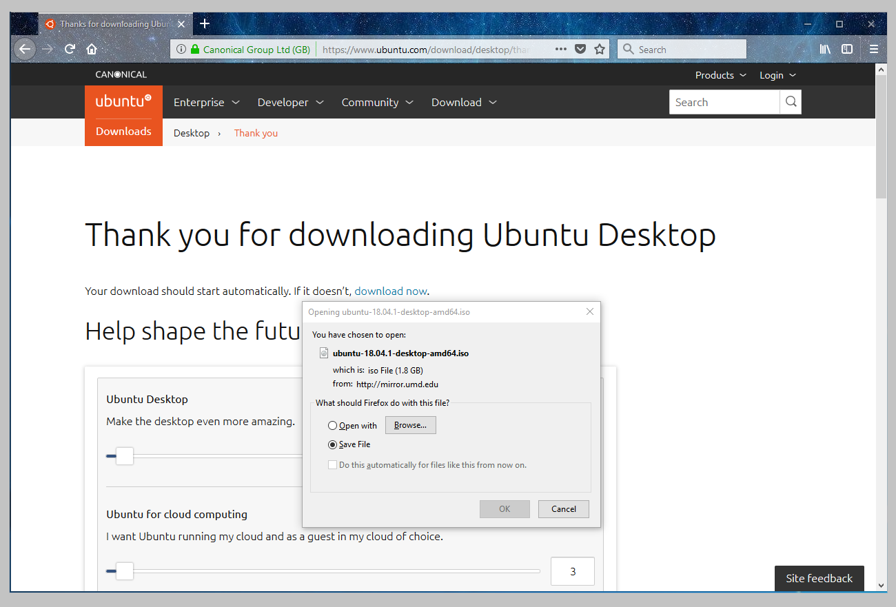
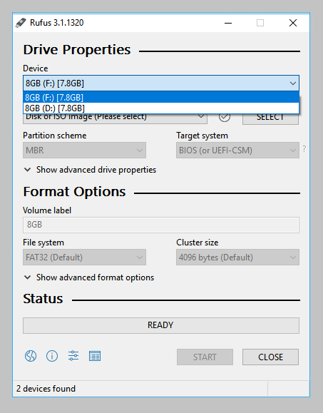
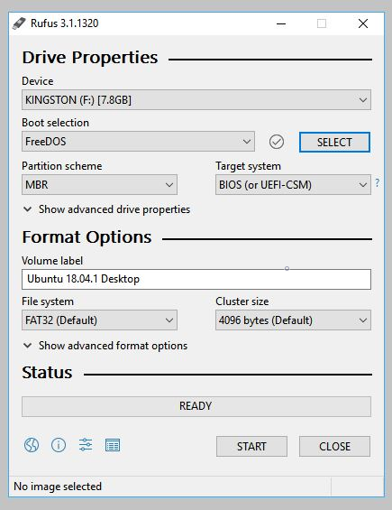
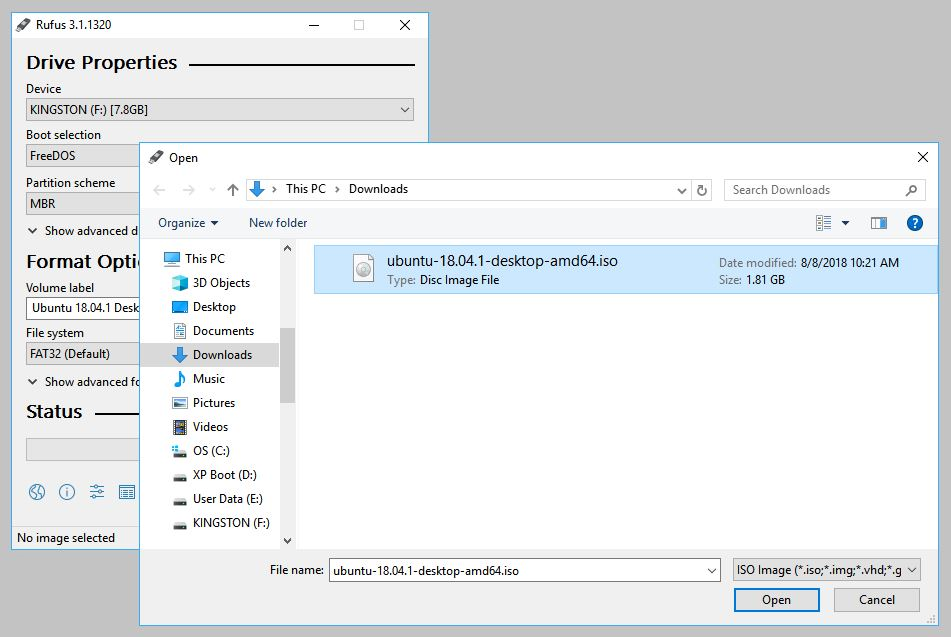
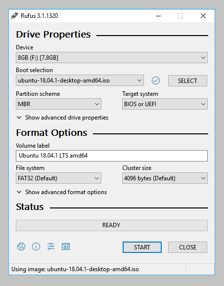
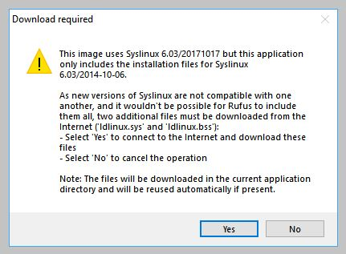
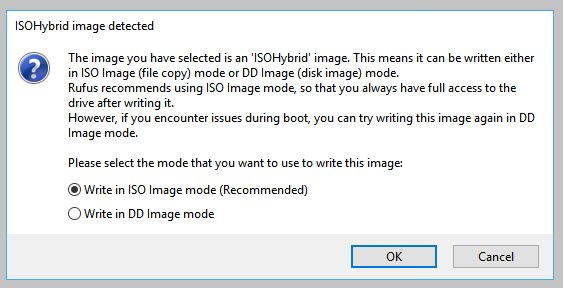
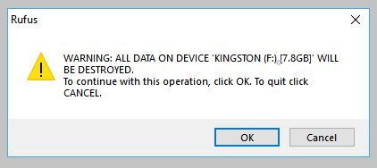
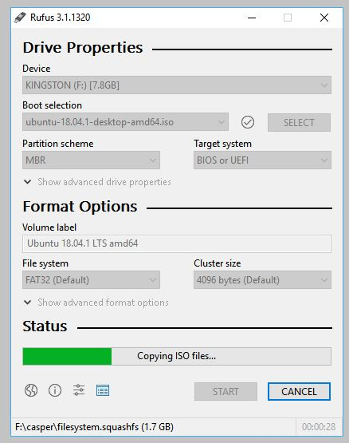
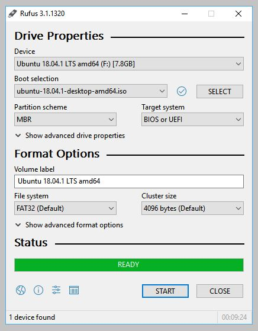

# Create a bootable USB stick on Windows

## Overview
Duration: 1:00

With a bootable Ubuntu USB stick, you can:

- Install or upgrade Ubuntu
- Test out the Ubuntu desktop experience without touching your PC configuration
- Boot into Ubuntu on a borrowed machine or from an internet cafe
- Use tools installed by default on the USB stick to repair or fix a broken
  configuration

Creating a bootable Ubuntu USB stick from Microsoft Windows is very simple and we're going to cover the process in the next few steps.

Alternatively, we also have tutorials to help you create a bootable USB stick from both [Ubuntu][usbubuntu] and [Apple macOS][usbmacos].

## Requirements
Duration: 1:00

You will need:

- A 4GB or larger USB stick/flash drive
- Microsoft Windows XP or later
- [Rufus][rufus], a free and open source USB stick writing tool
- An Ubuntu ISO file. See [Get Ubuntu][getubuntu] for download links

negative
: Take note of where your browser saves downloads: this is normally a directory called 'Downloads' on your Windows PC. Don't download the ISO image directly to the USB stick!

## USB selection
Duration: 0:30

Perform the following to configure your USB device in Rufus:

1. Launch Rufus
1. Insert your USB stick
1. Rufus will update to set the device within the **Device** field
1. If the **Device** selected is incorrect (perhaps you have multiple USB storage devices), select the correct one from the device field's drop-down menu

positive
: You can avoid the hassle of selecting from a list of USB devices by ensuring no other devices are connected.

## Boot selection and Partition scheme
Duration: 0:30

Now choose the Boot selection.  Choices will be *Non bootable* and *FreeDOS*.  Since you are creating a bootable Ubuntu device select **FreeDOS**.

The default selections for Partition scheme (*MBR*) and Target system (*BIOS (or UEFI-CSM)*) are appropriate (and are the only options available).

## Select the Ubuntu ISO file
Duration: 0:30

To select the Ubuntu ISO file you downloaded previously, click the **SELECT** to the right of "Boot selection".  If this is the only ISO file present in the Downloads folder you will only see one file listed.

Select the appropriate ISO file and click on **Open**.

## Write the ISO
Duration: 0:30

The *Volume label* will be updated to reflect the ISO selected.

Leave all other parameters with their default values and click **START** to initiate the write process.

## Additional downloads
Duration: 1:00

You may be alerted that Rufus requires additional files to complete writing the ISO.  If this dialog box appears, select **Yes** to continue.

## Write warnings
Duration: 0:30

You will then be alerted that Rufus has detected that the Ubuntu ISO is an *ISOHybrid image*. This means the same image file can be used as the source for both a DVD and a USB stick without requiring conversion.

Keep *Write in ISO Image mode* selected and click on **OK** to continue.

Rufus will also warn you that all data on your selected USB device is about to be destroyed. This is a good moment to double check you've selected the correct device before clicking **OK** when you're confident you have.

negative
: If your USB stick contains multiple partitions Rufus will warn you in a separate pane that these will also be destroyed.

## Writing the ISO
Duration: 10:00

The ISO will now be written to your USB stick, and the progress bar in Rufus will give you some indication of where you are in the process. With a reasonably modern machine, this should take around 10 minutes.  Total elapsed time is shown in the lower right corner of the Rufus window.

## Installation complete
Duration: 0:30

When Rufus has finished writing the USB device, the Status bar will be green filled and the word **READY** will appear in the center.  Select **CLOSE** to complete the write process.

Congratulations! You now have Ubuntu on a USB stick, bootable and ready to go.

If you want to install Ubuntu, take a look at our [install Ubuntu desktop tutorial][ubuntudesktop].

### Finding help

If you get stuck, help is always at hand:

* [Ask Ubuntu][askubuntu]
* [Ubuntu Forums][ubuntuforums]
* [IRC-based support][ircsupport]

<!-- LINKS -->
[usbubuntu]: https://tutorials.ubuntu.com/tutorial/tutorial-create-a-usb-stick-on-ubuntu
[usbmacos]: https://tutorials.ubuntu.com/tutorial/tutorial-create-a-usb-stick-on-macos
[getubuntu]: https://www.ubuntu.com/download
[ubuntudesktop]: https://tutorials.ubuntu.com/tutorial/tutorial-install-ubuntu-desktop
[askubuntu]: https://askubuntu.com/
[ubuntuforums]: https://ubuntuforums.org
[ircsupport]: https://wiki.ubuntu.com/IRC/ChannelList
[rufus]: https://rufus.ie/
