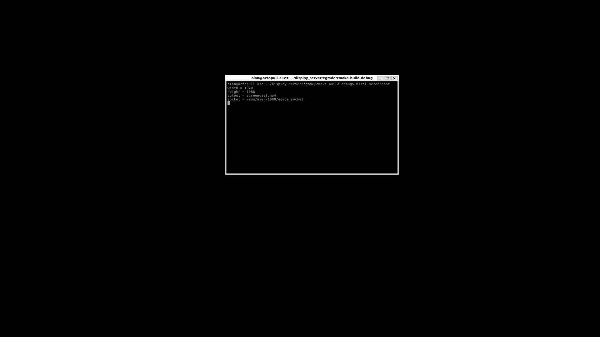
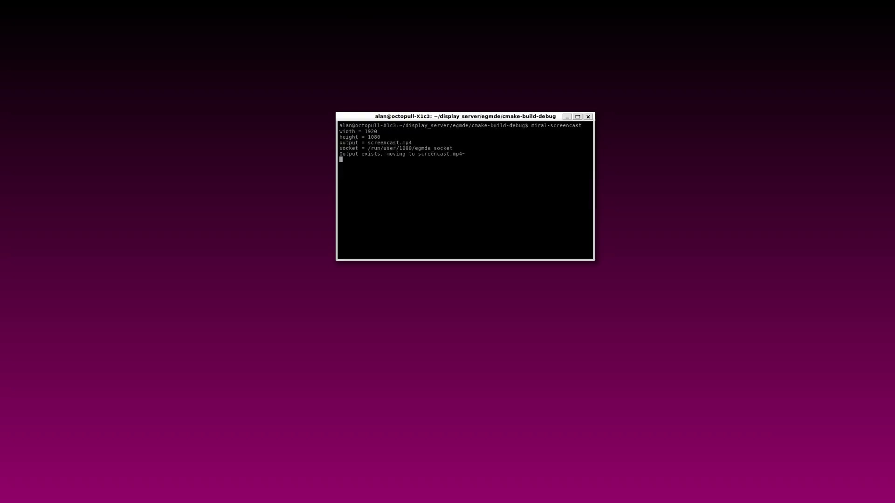
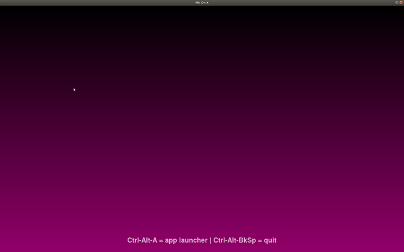
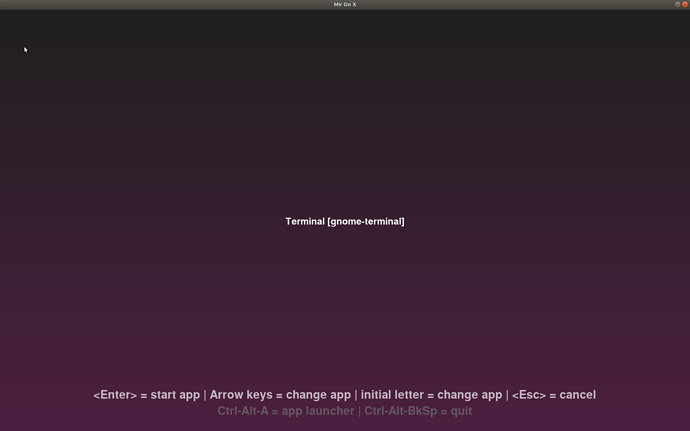
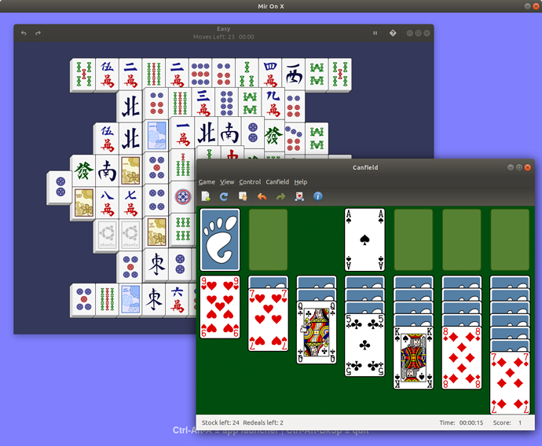

#  Egmde: Example Mir Desktop Environment (for Wayland)

## Overview

[Mir](https://mirserver.io) is a library designed to facilitate writing GUI shells for a range of platform from IoT and phones to desktops.

This tutorial will take you through the development of an example desktop environment that supports Wayland applications.

### What you'll learn

You will learn how to employ the Mir API to produce a simple, but usable desktop environment: egmde.

### What you'll need

You can follow the steps in this tutorial on any supported release of Ubuntu from 17.10 or on Fedora from release 28. *Unfortunately, the toolkit support for Wayland in Ubuntu 16.04LTS isn't sufficiently up to date for everything to work.*

## Preparation
Duration: 4:00

The code in this tutorial needs [Mir 0.31](https://community.ubuntu.com/t/mir-0-31-0-release/4637/6) or later. Mir 0.31 exists in Ubuntu 18.04 and Fedora 28 archives.

On Ubuntu, it is recommended to use the mir-team/release PPA which is available for all current releases of Ubuntu.

### On Ubuntu:

Add the mir-team/release PPA on Ubuntu:

```bash
sudo apt-add-repository ppa:mir-team/release
sudo apt update
```

Install some development tools and the Mir libraries. It is also useful to install the `weston` package as the example makes use of `weston-terminal` as a Wayland based terminal application and the Qt toolkit's Wayland support : `qtwayland5`.

```bash
sudo apt install g++ cmake
sudo apt install libmiral-dev mir-graphics-drivers-desktop 
sudo apt install weston qtwayland5
```

### On Fedora:

Install some development tools and the Mir libraries. It is also useful to install the `weston` package as the example makes use of `weston-terminal` as a Wayland based terminal application and the Qt toolkit's Wayland support : `qtwayland5`.

```bash
sudo dnf install gcc-c++ cmake
sudo dnf install mir-devel
sudo dnf install weston qt5-qtwayland
```

## Step 1: A minimally viable shell
Duration: 4:00

To illustrate Mir we're going to review code from a (very simple) window manager. It runs on desktops, tablets and phones and supports keyboard, mouse and touch input. It will support applications using the GTK and Qt toolkits, SDL applications and (using Xwayland X11 applications.

The full code for this example is available on github:

```bash
git clone https://github.com/AlanGriffiths/egmde.git
cd egmde
git checkout article-1
```

*Naturally, the code is likely to evolve, so you will find other branches, but this branch goes with this stage.*
 
 Assuming that you’ve `libmiral-dev` installed as described above you can now build egmde as follows:

```bash
mkdir build
cd build
cmake ..
make
```

After this you can start a basic egmde based desktop. This will use VT4, so first switch to VT4 (Ctrl-Alt-F4) to sign in and switch back again. Then type:

```bash
./egmde-desktop
```

You should see a blank screen with a `weston-terminal` session. From this you can run commands and, in particular, start graphical applications. Perhaps `qtcreator` to examine the code?



## Step 1: The code
Duration: 3:00

A lot of the functionality (default placement of windows, menus etc.) comes with Mir's `libmiral` library. For this exercise we have implemented one class and written a main function that injects it into Mir. The main program looks like this:

```c++
using namespace miral;

int main(int argc, char const* argv[])
{
    MirRunner runner{argc, argv};

    return runner.run_with(
        {
            set_window_management_policy<egmde::WindowManagerPolicy>()
        });
}
```

Yes, you’ve guessed it: the egmde specific code is in `egmde::WindowManagerPolicy`. The class looks like this:

```c++
class WindowManagerPolicy : public CanonicalWindowManagerPolicy
{
public:
    using CanonicalWindowManagerPolicy::CanonicalWindowManagerPolicy;

    bool handle_keyboard_event(MirKeyboardEvent const* event) override;

    bool handle_pointer_event(MirPointerEvent const* event) override;

    bool handle_touch_event(MirTouchEvent const* event) override;

    Rectangle confirm_placement_on_display(
        WindowInfo const& window_info, MirWindowState new_state, Rectangle const& new_placement) override;

    void handle_request_drag_and_drop(WindowInfo& window_info) override;

    void handle_request_move(WindowInfo& window_info, MirInputEvent const* input_event) override;

    void handle_request_resize(WindowInfo& window_info, MirInputEvent const* input_event, MirResizeEdge edge) override;

private:
...
};
```

These are the functions that it is necessary to implement for a minimal shell. I won't reproduce them all here, but this should give a flavor:

```c++
bool egmde::WindowManagerPolicy::handle_keyboard_event(MirKeyboardEvent const* event)
{
    auto const action = mir_keyboard_event_action(event);
    auto const shift_state = mir_keyboard_event_modifiers(event) & shift_states;

    if (action == mir_keyboard_action_down && shift_state == mir_input_event_modifier_alt)
    {
        switch (mir_keyboard_event_scan_code(event))
        {
            case KEY_F4:
                tools.ask_client_to_close(tools.active_window());
                return true;

            case KEY_TAB:
                tools.focus_next_application();
                return true;

            case KEY_GRAVE:
                tools.focus_next_within_application();
                return true;

            default:;
        }
    }

    return false;
}
```

### Keeping score

There's very little code needed to get this basic shell running:

```bash
$ wc -l *.h *.cpp *.sh
   88 egwindowmanager.h
   34 egmde.cpp
  420 egwindowmanager.cpp
   47 egmde-desktop.sh
  589 total
```

## Step 2: keymap and wallpaper
Duration: 4:00

At the end of step 1 we could run egmde as a desktop and run and use Wayland based applications. Those of us in Europe (or elsewhere outside the USA) will soon notice that the keyboard layout has defaulted to US, so I’ll show how to fix that. And the black background is rather depressing, so I’ll show how to implement a simple wallpaper; and, finally, how to allow the user to customize the wallpaper.

Along the way we’ll discuss the way the Mir API works with us to make it easy to combine features.

Assuming you're still in the `build` directory used in step 1.

```bash
git checkout article-2
make
```
After this you can once again start a basic egmde based desktop:

```bash
./egmde-desktop
```


You should see a simple gradient wallpaper with a weston-terminal session.

You can set the wallpaper colour when starting the desktop by supplying a --wallpaper parameter, and the keyboard layout with --keymap like this:

```bash
./egmde --wallpaper 0xff3737 --keymap gb
```

Alternatively, these options can be specified in a config file:

```bash
$ cat ~/.config/egmde.config 
wallpaper=0xff0d0
keymap=gb
```

## Step 2: The `main()` code
Duration: 3:00

The previous code is largely unchanged. Just the egmde.cpp file is changed to add a couple of new headers and update the main program that looked like this:

```cpp
int main(int argc, char const* argv[])
{
    MirRunner runner{argc, argv};

    return runner.run_with(
        {
            set_window_management_policy<egmde::WindowManagerPolicy>()
        });
}
```

Now it is:

```cxx
int main(int argc, char const* argv[])
{
    MirRunner runner{argc, argv};

    egmde::Wallpaper wallpaper;

    runner.add_stop_callback([&] { wallpaper.stop(); });

    return runner.run_with(
        {
            Keymap{},
            CommandLineOption{
                std::ref(wallpaper), 
                "wallpaper", 
                "Colour of wallpaper RGB", 
                "0x92006a"},
            StartupInternalClient{"wallpaper", std::ref(wallpaper)},
            set_window_management_policy<egmde::WindowManagerPolicy>()
        });
}
```

The `Keymap` utility handles setting the keymap, used like this it adds and uses a configuration option. (It can also be used to set a specific keymap on construction, or to change it dynamically while the shell is running.)

The `CommandLineOption` utility does a number of things, adds a configuration option and calls it’s first argument with the configured value. To make this work nicely with an instance of egmde::Wallpaper the latter implements the function call operator to accept the wallpaper colour.

The `StartupInternalClient` utility takes an “internal client” object (the wallpaper), waits for the server to start and then connects the client to the server, notifying the internal client object of both the client-side and server-side connection so that the server “knows” which client this is.

By supplying customizations to the `run_with()` method as a list Mir makes it easy to ensure the server is initialized before they are used and it gives the user flexibility in setting these objects up. For example, the wallpaper instance is created and referenced in a shutdown hook using `add_stop_callback()` before being used in the `run_with()` list. This is achived by declaring `run_with()` to take an initinalizer list:

```cpp
    auto run_with(std::initializer_list<std::function<void(::mir::Server&)>> options) -> int;
```

Each of the supplied utilities “knows” how to integrate itself into the system using the `mir::Server`. User code should not need to do this directly (so part of the Mir “abstraction layer” is to keep this as an opaque type).

This approach has been proven effective by use in more advanced servers such as Unity8.

## Step 2: The `Wallpaper` code
Duration: 4:00

The `Wallpaper` class is what we’ll be implementing here, it uses a simple `Worker` class to pass work off to a separate thread. I’ll only show the header here as the methods are self-explanatory:

```c++
class Worker
{
public:
    ~Worker();
    void start_work();
    void enqueue_work(std::function<void()> const& functor);
    void stop_work();
…
};
```

### The Wallpaper class

```c++
class Wallpaper : Worker
{
public:
    // These operators are the protocol for an "Internal Client"
    void operator()(mir::client::Connection c) { start(std::move(c)); }
    void operator()(std::weak_ptr<mir::scene::Session> const&){ }

    // Used in initialization to set colour
    void operator()(std::string const& option);

    void start(mir::client::Connection connection);
    void stop();

private:
    uint8_t colour[4] = { 0x0a, 0x24, 0x77, 0xFF };
    std::mutex mutable mutex;
    mir::client::Connection connection;
    mir::client::Surface surface;
    MirBufferStream* buffer_stream = nullptr;
    mir::client::Window window;

    void create_window();
    void handle_event(MirWindow* window, MirEvent const* ev);
    static void handle_event(MirWindow* window, MirEvent const* event, void* context);
};
```

In the current state of development Mir “internal clients” can only use the legacy Mir cliient API (not Wayland) but that is adequate for our current purpose.

Most of the work happens in the create_surface() method that creates a surface that will never get focus (and therefore will never be raised above anything else):

```c++
void egmde::Wallpaper::create_window()
{
    unsigned width = 0;
    unsigned height = 0;

    DisplayConfig{connection}.for_each_output([&width, &height](MirOutput const* output)
    {
        if (!mir_output_is_enabled(output))
            return;

         width = std::max(width, mir_output_get_logical_width(output));
         height = std::max(height, mir_output_get_logical_height(output));
    });
    
    std::lock_guard<decltype(mutex)> lock{mutex};

    surface = Surface{mir_connection_create_render_surface_sync(connection, width, height)};

    buffer_stream = mir_render_surface_get_buffer_stream(surface, width, height, mir_pixel_format_xrgb_8888);

    window = WindowSpec::for_gloss(connection, width, height)
        .set_name("wallpaper")
        .set_fullscreen_on_output(0)
        .set_event_handler(&handle_event, this)
        .add_surface(surface, width, height, 0, 0)
        .create_window();

    MirGraphicsRegion graphics_region;

    mir_buffer_stream_get_graphics_region(buffer_stream, &graphics_region);

    render_gradient(&graphics_region, colour);
    mir_buffer_stream_swap_buffers_sync(buffer_stream);
}
```

And the actual s/w rendering:

```c++
void render_gradient(MirGraphicsRegion* region, uint8_t* colour)
{
    char* row = region->vaddr;

    for (int j = 0; j < region->height; j++)
    {
        auto* pixel = (uint32_t*)row;
        uint8_t pattern_[4];
        for (auto i = 0; i != 3; ++i)
            pattern_[i] = (j*colour[i])/region->height;
        pattern_[3] = colour[3];

        for (int i = 0; i < region->width; i++)
            memcpy(pixel + i, pattern_, sizeof pixel[i]);

        row += region->stride;
    }
}
```

The remaining code isn’t shown here. It deals with startup, shutdown and changes to the display layout.

For those that are keeping score:

```bash
$ wc -l *.h *.cpp *.sh
   84 egwallpaper.h
   88 egwindowmanager.h
   45 egmde.cpp
  205 egwallpaper.cpp
  420 egwindowmanager.cpp
   47 egmde-desktop.sh
  889 total
```

## Step 3: Adding a launcher
Duration: 3:00

At the end of step 2 we could run egmde as a desktop and run and start Wayland based applications from a terminal. We could also select the keyboard layout and cusomize the wallpaper.

In this article we provide an integrated “launcher” to start applications so that applications do not need to be launched from the terminal.

Assuming you're still in the `build` directory used in step 1.

```bash
git checkout article-3
make
```

After this you can once again start a basic egmde based desktop:

```bash
./egmde-desktop
```

You should see a simple gradient wallpaper with simple instructions:



If you press Ctrl-Alt-A then the launcher appears on top of whatever you are currently running (initially nothing) and updated instructions:



That should be enough of a clue to get you started.

## Step 3: The code
Duration: 0:30

### The `Launcher`

The main addition to the code is the “launcher”. I’ll concentrate on the changes to egmde.cpp as the Launcher class itself is a “legacy” Mir client. It is on my list to support “internal” Wayland clients in Mir, but that hasn’t happened yet.
The first update to the main program is adding this:

```c++
    ExternalClientLauncher external_client_launcher;
    egmde::Launcher launcher{external_client_launcher};
```

*Note: If you look at the real code at the time of writing you’ll see there’s a bit of preprocessor magic to support the released version of Mir which doesn’t have ExternalClientLauncher. I’m going to ignore this (and another workaround for the lack of logind support) as these will be addressed by a Mir update in the near future.*

### `main()`

Next, there’s a piece of code or handling keyboard input and showing the launcher:

```c++
    auto const keyboard_shortcuts = [&](MirEvent const* event)
        {
            if (mir_event_get_type(event) != mir_event_type_input)
                return false;

            MirInputEvent const* input_event = mir_event_get_input_event(event);
            if (mir_input_event_get_type(input_event) != mir_input_event_type_key)
                return false;

            MirKeyboardEvent const* kev = mir_input_event_get_keyboard_event(input_event);
            if (mir_keyboard_event_action(kev) != mir_keyboard_action_down)
                return false;

            MirInputEventModifiers mods = mir_keyboard_event_modifiers(kev);
            if (!(mods & mir_input_event_modifier_alt) || !(mods & mir_input_event_modifier_ctrl))
                return false;

            switch (mir_keyboard_event_scan_code(kev))
            {
            case KEY_A:
                launcher.show();
                return true;

            case KEY_BACKSPACE:
                runner.stop();
                return true;

            default:
                return false;
            }
        };
```

This is a lambda that is later added to the Mir event processing and looks for either Ctrl-Alt-A or Ctrl-Alt-BkSp and shows the launcher or stops the runner accordingly.

Finally, as promised, these are added to the `run_with()` list which now looks as follows:

```c++
    return runner.run_with(
        {
            ...
            external_client_launcher,
            StartupInternalClient{"launcher", std::ref(launcher)},
            AppendEventFilter{keyboard_shortcuts},
            ...
        });
```

## Other changes since step 2
Duration: 1:00

### Better wallpaper
There’s also a small change to the wallpaper introduced in the previous article, it is now possible to customize both the top and bottom colour for the gradient. This followed from some “corridor testing” by my wife who found the previous option and default colour unappealing.

This allows a “better brighter wallpaper” (as well as my choice):



Here’s the corresponding .config file:

```bash
$ cat ~/.config/egmde.config 
wallpaper-top=0x8080ff
wallpaper-bottom=0x8080ff
```

### Better keymap

Another small change is that I found a way to pick up the current keyboard and added that to the miral-desktop launch script so that it doesn’t need to be set by hand.

### The code
I’ll first deal quickly with the wallpaper changes these options are provided by:

```c++
    CommandLineOption{[&](auto& option) { wallpaper.top(option);},
                      "wallpaper-top",    "Colour of wallpaper RGB", "0x000000"},
    CommandLineOption{[&](auto& option) { wallpaper.bottom(option);},
                      "wallpaper-bottom", "Colour of wallpaper RGB", "0x92006a"},
```

The corresponding changes to the Wallpaper class are easy to follow.

## A final word
duration: 0:30

The Mir "Abstraction Layer" API (libmiral) is designed so that keeping separate things separate is easy: the launcher code doesn’t have any inter-dependency with the wallpaper or the the window management code. So we could replace any of these without affecting the others.

That makes it easy to understand the individual components and customise them to build a  server to suit your requirements.