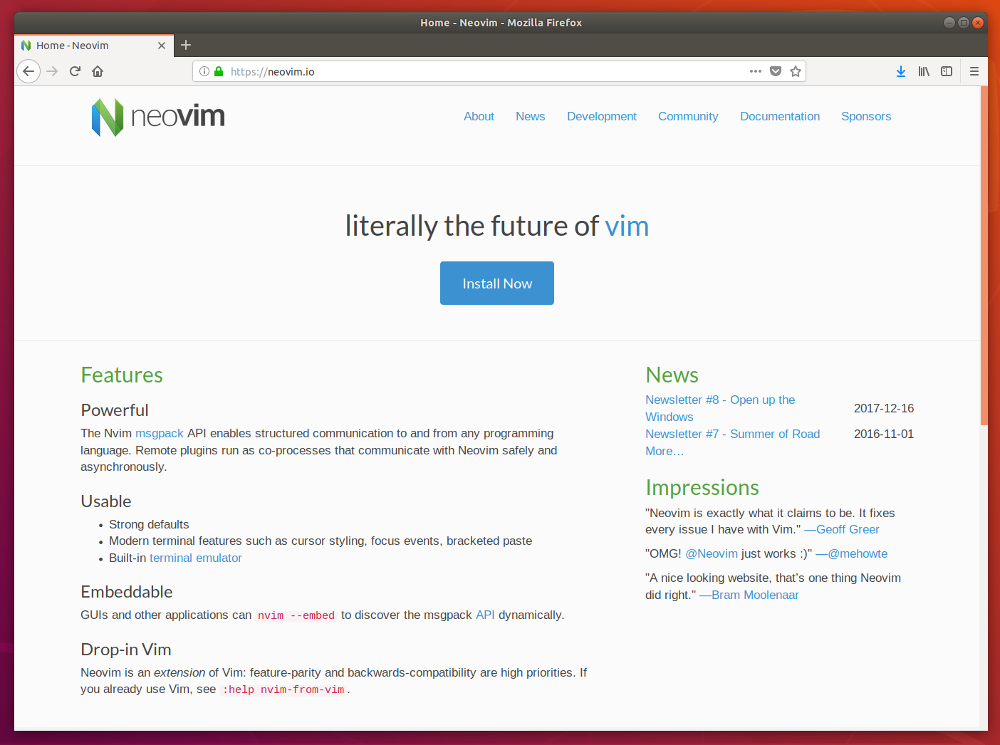

# How to install Neovim on Ubuntu Desktop 18.04 LTS

## Overview
Duration: 1:00

[Neovim](https://neovim.io/) is a free and open source text editor that is an extension of [Vim](https://www.vim.org/), the ubiquitous text editor. The project began in 2014 and has continued to rapidly grow over the years, into a modern text editor that is extensible and maintainable. 

Neovim and Vim share the same configuration syntax, file and commands, therefore if you are already a Vim user who is interested in Neovim, transitioning to the text editor will be friction-less.

This tutorial will show you how to install Neovim from the command line and operate the text editor from your Ubuntu Desktop.

Survey
: How will you use this tutorial?
 - Only read through it
 - Read it and complete the exercises
: What is your current level of experience?
 - Novice
 - Intermediate
 - Proficient

### What you'll learn

- How to install Neovim.
- How to start up Neovim.
- Where to find documentation for Neovim.

### What you'll need

- A computer with Ubuntu Desktop 18.04 LTS installed.
- Some basic command-line knowledge.
