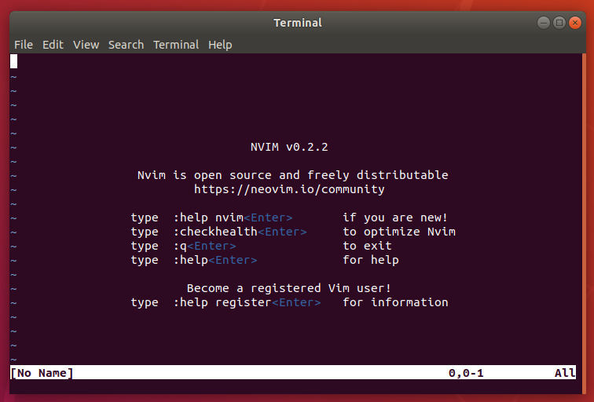

# How to install Neovim on Ubuntu Desktop 18.04 LTS

## Overview
Duration: 1:00

[Neovim](https://neovim.io/) is a free and open source text editor that is an extension of [Vim](https://www.vim.org/), the ubiquitous text editor. The project began in 2014 and has continued to rapidly grow over the years, into a modern text editor that is extensible and maintainable. 

Neovim and Vim share the same configuration syntax, file and commands, therefore if you are already a Vim user who is interested in Neovim, transitioning to the text editor will be friction-less.

This tutorial will show you how to install Neovim from the command line and operate the text editor from your Ubuntu Desktop.


Survey
: How will you use this tutorial?
 - Only read through it
 - Read it and complete the exercises
: What is your current level of experience?
 - Novice
 - Intermediate
 - Proficient

### What you'll learn

- How to install Neovim.
- How to start up Neovim.
- Where to find documentation for Neovim.

### What you'll need

- A computer with Ubuntu Desktop 18.04 LTS installed.
- Some basic command-line knowledge.

## Installing Neovim
Duration: 2:00

### Update the repository cache

We are going to start up a terminal window and update the repository cache so that we can download package information. To start up the terminal, we can either;

* Click on the "Apps" icon, search for `terminal` and start a session.
* Use the `Ctrl + Alt> + t` keyboard shortcut to start a session.

Once the terminal window is displayed, enter the following commands to update the repository cache;

```bash
sudo apt update
```

positive
: **Note**
You will be prompted to enter your account password. Type in your password and press the `Enter` key to continue.


### Install Neovim

In the terminal, enter the following commands to install the Neovim;

```bash
sudo apt install neovim
```

positive
: **Note**
After the commands execute successfully, you will be prompted to continue with the installation. Type in the letter `y` and press the `Enter` key to continue.


## Basic Neovim usage
Duration: 1:00

### Starting up Neovim

By now, we should have successfully installed Neovim on our Ubuntu Desktop. To access Neovim, we can either;

* Type into the terminal `nvim` and press the `Enter` key to continue.
* Click on the "Apps" icon, search for `neovim` and press the `Enter` key to continue, as demonstrated below;


A welcome window should appear displaying information about the version of Neovim you are currently running on and helpful information to get started with the text editor.



### Basic usage

To learn more about editing and navigating in Neovim, you can either,

* Type into the editor the following commands, `:Tutor<Enter>` to learn more about Neovim.
* Go to your browser and access the [user documentation online](https://neovim.io/doc/user/).