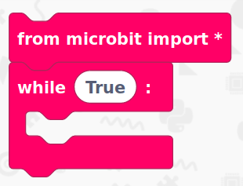

# Getting started with the BBC micro:bit

## What is the micro:bit mode?

The micro:bit mode within EduBlocks v3 allows you to code the BBC micro:bit in MicroPython using a drag and drop interface. 

## What is a BBC micro:bit?
Duration: 2:00

The [BBC micro:bit](http://microbit.org/) is a small microcontroller which was originally created to be handed out to 1 million eleven year old children (Year 7's) in the UK. They are now available for public availability and the project is now carried on by the Micro:bit Educational Foundation. The micro:bit consists of:

A 5x5 LED matrix display

2 tactile buttons

An accelerometer and compass

A radio and bluetooth antenna

An edge connector for accessories

## Imports and Loops
Duration: 1:00

Now its time to build our code. We can drag our code blocks from the EduBlocks toolbar which is on the left hand side of the screen. The pink blocks can be found in the basic menu. This will form the start of the code. The first block will import the code we need to control stuff on our micro:bit whilst the second block will create a forever loop

positive
: **NOTE:**
From here on, the rest of the code will put inside of this loop.

## When the A button is pressed
Duration: 1:00

Next, we need to scroll a message when the A button is pressed. We can do this by creating an if statement to check for a button press. Grab an `if True` block from Basic and then drag a `button_a.is_pressed()` block from Buttons and put that inside of the If statement where it says `True`.

.png)

Now we need to get a block which will scroll a message. From Display, get a `display.scroll("Hello World")` block and replace `Hello World` with `Button A Pressed`. Put this block inside of the If statement. 

.png)

## When the B button is pressed
Duration: 1:00

Now, we need to scroll a message when the B button is pressed. We can do this by creating an **elif** statement to check for a button press. Grab an `elif True` block from Basic and then drag a `button_a.is_pressed()` block from Buttons, click on the `a`dropdown and change it to `b` then, put that block inside of the elif statement where it says `True`.

.png)

Next, we need to get a block which will scroll another message. From Display, get a `display.scroll("Hello World")` block and replace `Hello World` with `Button B Pressed`. Put this block inside of the If statement. 

.png)

## Final Code
Duration: 1:00

You've now finished all of the code! It's time to check to see if we haven't missed a step or made a mistake. Now is your chance to check your code compared to the image below to check if it's all right.

.png)

## Download your code
Duration: 3:00

It's now time to download your code!

Connect the micro:bit to your computer using a micro USB cable. Your micro:bit will show up on your computer as a drive called 'MICROBIT'. 

To download our code onto the microbit. Click the DOWNLOAD HEX button in the navigation bar at the top of EduBlocks. This will download a 'hex' file, which is a compact format of your program that your micro:bit can read. 

Once your code has downloaded, head over to your downloads folder where you'll see a file named `microbit-edublocks.hex`. Drag this onto the `MICROBIT` drive and you'll see a yellow flashing light on the back of your micro:bit. Once it's finished flashing, you're code will now run!

## Test your code
Duration: 1:00

You should now be able to test your code.
Press the A button and watch it scroll that the A button has been pressed.
Press the B button and watch it scroll that the B button has been pressed.
Congratulations, you've successfully used the micro:bit's buttons!

### What you've learnt

  - Learnt how to use the micro:bit's buttons
  - Learnt how to use logical statements
  - Learnt how to use a loop
  - Learnt how to scroll a message on the micro:bit

### Challenge

Now you know how the buttons work, can you make the micro:bit do something else on a button press?