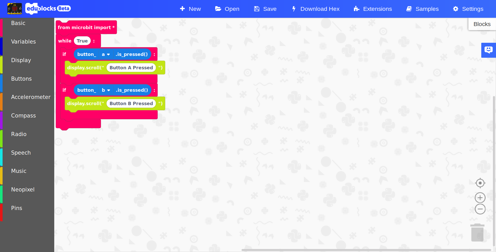

# Getting started with the BBC micro:bit

## What is the micro:bit mode?

The micro:bit mode within EduBlocks v3 allows you to code the BBC micro:bit in MicroPython using a drag and drop interface. 

## What is the BBC micro:bit
Duration: 2:00

The BBC micro:bit is a small microcontroller which was originally created to be handed out to 1 million eleven year old children (Year 7's) in the UK. They are now available for public availability and the project is now carried on by the Micro:bit Educational Foundation. The micro:bit consists of:
  - A 5x5 LED matrix display
  - 2 tactile buttons
  - An accelerometer and compass
  - A radio and bluetooth antenna
  - An edge connector for accessories

## Launching the micro:bit mode
Duration: 3:00

So, you've got your micro:bit and you want to get started with using it with EduBlocks. Let's get into it!

### You will need:
  - A BBC micro:bit
  - An internet connection
  - A computer with a USB port
  - A micro USB cable

### Load up EduBlocks

In a modern browser of your choice (we've found Google Chrome works best), launch the following web address:

positive
: **Web Address**
  [https://app.edublocks.org](https://app.edublocks.org)

### Launch the mode

You’ll need to load up EduBlocks. You can do this by opening a web browser of your choice and typing [https://app.edublocks.org](https://app.edublocks.org) into the search box. Once you've loaded up EduBlocks, you'll be presented with the mode selector. 

Now, we want to select the micro:bit mode. To do this simply click on the blue select button underneath the micro:bit icon. This will load up the micro:bit mode.

Once you've selected the micro:bit mode, you should see it pop up:

## Loading up samples
Duration: 4:00

Once inside the micro:bit mode, we have a range of different things we can do. Before you write your own program it's a good idea to load up a sample so you can see how EduBlocks works.

To load up a sample, click the samples button in the blue navbar at the top, this will load up the following dialog box: 

Click on the blue open button next to the "Buttons" sample. 
Once you've done this, a few blocks should appear in the workspace.

## Flashing code onto the micro:bit
Duration: 3:00

Here is how to download your code onto the micro:bit editor:

Connect the micro:bit to your computer using a micro USB cable. Your micro:bit will show up on your computer as a drive called 'MICROBIT'. 

To download our code onto the microbit. Click the DOWNLOAD HEX button in the navigation bar at the top of EduBlocks. This will download a 'hex' file, which is a compact format of your program that your micro:bit can read. 

Once your code has downloaded, head over to your downloads folder where you'll see a file named `microbit-edublocks.hex`. Drag this onto the `MICROBIT` drive and you'll see a yellow flashing light on the back of your micro:bit. Once it's finished flashing, your code will now run!

## Flashing with webUSB
Duration: 4:00

If you run the chrome browser version 65+ and on Windows 10, Linux, macOS or Android, you can use a tool called webUSB to flash your micro:bit directly from the browser.

You need to have the latest firmware version on your micro:bit to be able to do this, to learn how to check this and update your firmware, [click here](https://support.microbit.org/support/solutions/articles/19000084059-beta-testing-web-usb)

To do this, load up some code in the micro:bit mode (look at the 'Load up a sample' step to find out how to do this).

Make sure your micro:bit is plugged into your computer, then, press the settings button in the top right hand corner.

This will load up the settings dialog, you'll see an option that says "Flash Hex", go ahead and press "Go" button next to it.

You'll now be able to see a dialog in the top left hand corner of chrome, select "BBC micro:bit CMSIS-DAP" from the list and click "Connect" to start flashing.

The percentage dialog will go up as the file transfers to your micro:bit, you've now flashed your micro:bit via webUSB!

