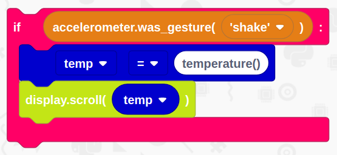
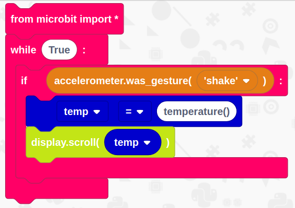

# micro:bit Thermometer

## Overview

In this tutorial we are going to use the built-in temperature sensor on the micro:bit to get the current temperature of the room you are in.

You will need 
- An internet connection
- A BBC micro:bit
- A USB cable

## Get Started
Duration: 1:00

You’ll need to load up EduBlocks. You can do this by opening a web browser of your choice and typing [https://app.edublocks.org](https://app.edublocks.org) into the search box. Once you've loaded up EduBlocks, you'll be presented with the mode selector. 

Now, we want to select the micro:bit mode. To do this simply click on the blue select button underneath the micro:bit icon. This will load up the micro:bit mode.

Once you've selected the micro:bit mode, you should see it pop up:

## Imports and Loops
Duration: 1:00

Now its time to build our code. We can drag our code blocks from the EduBlocks toolbar which is on the left hand side of the screen. The pink blocks can be found in the basic menu. This will form the start of the code. The first block will import the code we need to control stuff on our micro:bit whilst the second block will create a forever loop

positive
: **NOTE:**
From here on, the rest of the code will put inside of this loop.

## Check for a shake
Duration: 2:00

Next, we need to check if the micro:bit has been shaken. Grab an `if` block from basic and then from Accelerometer, get a block which states `accelerometer.was_gesture('shake')` and put it inside of the if block where it says `True`. 

## Set a variable and scroll the temperature
Duration: 3:00

positive
: **NOTE:**
This code will go inside the if statement

We now need to check the the temperature of the micro:bit, do note though, this temperature is based of the micro:bit CPU so isn't exactly accurate. 

Go to `variables` and click the `Create Variable` button, name the variable `temp`. Drag in the block that says `temp = 0` inside of the if statement and change 0 to `temperature()`.

Now go to Display and drag in a `display.scroll(0)` block underneath the variable block you've just created, go into Variables and drag the block that says `temp` into where it says 0.

## Final Code
Duration: 1:00

You've now finished all of the code! It's time to check to see if we haven't missed a step or made a mistake. Now is your chance to check your code compared to the image below to check if it's all right.

## Download your code
Duration: 3:00

It's now time to download your code!

Connect the micro:bit to your computer using a micro USB cable. Your micro:bit will show up on your computer as a drive called 'MICROBIT'. 

To download our code onto the microbit. Click the DOWNLOAD HEX button in the navigation bar at the top of EduBlocks. This will download a 'hex' file, which is a compact format of your program that your micro:bit can read. 

Once your code has downloaded, head over to your downloads folder where you'll see a file named `microbit-edublocks.hex`. Drag this onto the `MICROBIT` drive and you'll see a yellow flashing light on the back of your micro:bit. Once it's finished flashing, you're code will now run!

## Test your code
Duration: 1:00

You should now be able to test your code.
Shake your micro:bit and you should see a reading of the temperature in celcius!
Congratulations, you've successfully created your own micro:bit thermometer!!

<iframe src="https://player.vimeo.com/video/322577663" width="640" height="360" frameborder="0" allowfullscreen></iframe>

### What you've learnt

  - Learnt how to use the micro:bit's temperature sensor
  - Learnt how to use logical statements
  - Learnt how to use a loop
  - Learnt how to scroll a variable on the micro:bit
