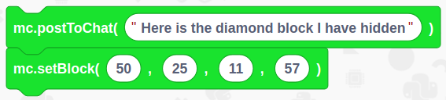
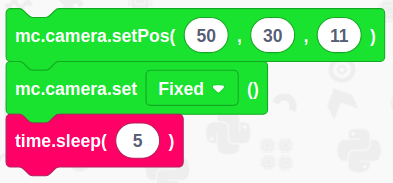
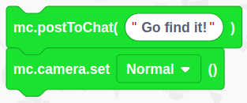
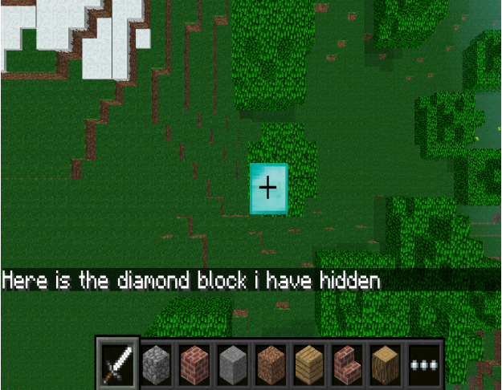

# Hide a Diamond, Find a Diamond

## Overview

In this tutorial, we are going to create a game where we hide a diamond in the Minecraft world, then it is the players quest to go seek out the treasure.

You will need 
- An internet connection
- A setup Raspberry Pi with EduBlocks Connect or EduBlocks Desktop installed

## Get Started
Duration: 1:00

Once you've followed our Raspberry Pi getting started guide (if you haven't already done so), you'll want to launch EduBlocks connect. Go to the Raspberry Pi menu, select Programming and you'll see EduBlocks Connect Listed. Click on it to launch it. 

 

Now go back into the same menu, select games and launch Minecraft Pi. When launched, select Start Game then Create New. Press ESC on your keyboard and minimise the window.

You’ll now need to load up EduBlocks. You can do this by opening a web browser of your choice and typing [https://app.edublocks.org](https://app.edublocks.org) into the search box. Once you've loaded up EduBlocks, you'll be presented with the mode selector. 

 

Now, we want to select the mode. To do this simply click on the blue select button underneath the Raspberry Pi icon. This will load up the Raspberry Pi mode.
If you're on a raspberry pi, it will go straight to the mode if you have EduBlocks connect running. However, if you want to access this mode from a PC, you'll be given the option to connect to your Raspberry Pi by typing it it's IP Address.

Once you've selected the Raspberry Pi mode, you should see it pop up:

## Imports and server setup
Duration: 2:00

Now its time to build our code. We can drag our code blocks from the EduBlocks toolbar which is on the left hand side of the screen. Our first 3 blocks of code can be found in the Basic Tab and the Minecraft General Tab, take a look, they are colour co-ordinated. Drag the blocks onto the workspace as shown in the diagram. In this section of code we are importing the Minecraft Module from the Minecraft Pi Library. Then we are importing time. The 3rd block creates a connection to the Minecraft server. 

## Post a message and hide the block
Duration: 2:00

Our next 2 blocks can all be found in the Minecraft commands section of the toolbar. Drag them over to the workspace and connect to the previous blocks. When entering text into blocks click inside - you can tab across. In this section of code we are firstly sending a message to the Minecraft server using postToChat to display the message. – Here is the block I have hidden. Then we are setting the position of where to hide the block.

## Set the camera position
Duration: 2:00

The next 3 blocks are going to set the camera position and then wait for 5 seconds, the first block will move the camera position to the x,y,z coordinates given,the second block will then fix the camera position so it can't move and then the third block will wait for 5 seconds before carrying onto the next section.

## Send a "find it message"
Duration: 2:00

For our final 2 blocks we need to go back to the Minecraft Commands section. Drag them onto the workspace and attach to the previous blocks. the final 2 blocks,the first sends a message to the Minecraft server using postToChat to display the message – “Go find it”. The second tells our camera to go back to normal setting.

## Final Code
Duration: 1:00

You've now finished all of the code! It's time to check to see if we haven't missed a step or made a mistake. Now is your chance to check your code compared to the image below to check if it's all right.

## Run your code

Now it’s time to run our code. Click on the green run button in the top right hand corner of the EduBlocks window. Then click on the Minecraft tab to return to our Minecraft world. Now go and seek the hidden treasure! You can see the coordinates at the top left hand corner of minecraft for guidance.

### Outcome

In this tutorial we have learnt how to import libraries, talk to the Minecraft server - in order to display a message, and use variables. We have used a set camera code and knowledge of the x, y and z co-ordinates to firstly hide a block and then find it.