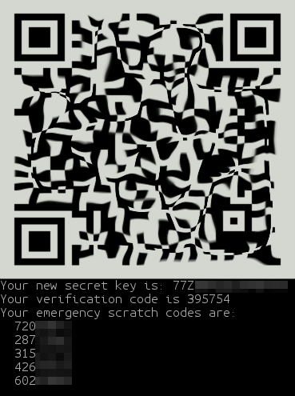

# Konfiguracja uwierzytelnienia dwuetapowego w SSH
Duration: 2:00

## Omówienie

SSH (ang. *secure shell*) jest rozwiązaniem często wykorzystywanym, aby uzyskać zdalny dostęp do komputerów z Linuksem. Ponieważ często używany jest do połączeń z urządzeniami zawierającymi ważne dane, zalecane jest korzystanie z dodatkowej warstwy bezpieczeństwa. W tym celu powstało **uwierzytelnianie dwuetapowe** (*2FA*).

### Czym jest uwierzytelnianie dwuetapowe

Uwierzytelnianie wielopoziomowe jest metodą potwierdzania tożsamości wykorzystującą więcej niż jedną metodę uwierzytelniania. Najczęstszy przykład uwierzytelniania dwuetapowego wykorzystuje połączenie **hasła** i **jednorazowego kodu** generowanego przez specjalną aplikację mobilną.

Wykorzystamy aplikację Google Authenticator dostępną na Androida (w [Sklepie Play]) i iOS (w [iTunes]) służącą do generowania kodów jednorazowych.

### Czego potrzebujesz

  - Komputera z systemem Ubuntu 16.04 LTS lub nowszym.
  - Smartfona z systemem Android lub iOS.
  - Skonfigurowanego połączenia SSH.
  - Dobrze, jeżeli rozumiesz niebezpieczeństwo spowodowane kradzieżą hasła.
  - Nie musisz wiedzieć, czym jest uwierzytelnianie dwuetapowe i jak ono działa.


## Instalacja i konfiguracja wymaganych pakietów
Duration: 3:00

### Instalacja modułu PAM Google Authenticatora

Rozpocznij sesję terminala i wprowadź:

```bash
sudo apt install libpam-google-authenticator
```


### Konfiguracja SSH

Aby SSH korzystało z modułu PAM Google Authenticatora, Dodaj następujący wiersz do pliku /etc/pam.d/sshd:

```
auth required pam_google_authenticator.so
```

Uruchom ponownie usługę `sshd` poleceniem:

```bash
sudo systemctl restart sshd.service
```

Zmodyfikuj plik `/etc/ssh/sshd_config` – zmień `ChallengeResponseAuthentication` z `no` na `yes`, aby ten fragment pliku wyglądał tak:

```
# Change to yes to enable challenge-response passwords (beware issues with
# some PAM modules and threads)
ChallengeResponseAuthentication yes # ZMIEŃ TĄ WARTOŚĆ NA YES

# Change to no to disable tunnelled clear text passwords
#PasswordAuthentication yes
```


## Konfiguracja uwierzytelniania
Duration: 2:00

Google Authenticator znacząco ułatwia konfigurację uwierzytelniania dwuetapowego, porównując na przykład z modułem libpam-oath.

Wprowadź w terminalu polecenie google-authenticator.

Otrzymasz kilka pytań, sugerowane opcje to:

  - Make tokens “time-base” (*klucze będą ograniczone czasowo*): yes
  - Update the `.google_authenticator` file (*zaktualizuj plik `.google_authenticator`*): yes
  - Disallow multiple uses (*nie pozwalaj na więcej niż jedno użycie*): yes
  - Increase the original generation time limit (*zwiększ limit czasowy*): no
  - Enable rate-limiting (*ograniczanie ilości prób*): yes

W trakcie procesu zobaczysz wielki kod QR i zapasowe kody, których możesz użyć, jeżeli nie będziesz mieć dostępu do telefonu: zapisz je na kartce i przechowuj w bezpiecznym miejscu.

To wszystko. Otwórzmy Google Authenticator i dodajmy kod w aplikacji.





negative
: Nie używaj niezaszyfrowanych usług, takich jak serwisy synchronizujące notatki do przechowywania tajnego klucza. Jeżeli nie chcesz wprowadzać go ręcznie, użyj kodu QR.

## Dodawanie tajnego klucza do Google Authenticatora
Duration: 2:00

Skorzystamy z najnowszej wersji Authenticatora ze Sklepu Play. Nie powinno to wyglądać znacznie inaczej w systemie iOS.


### Dodanie z użyciem kodu AR

Naciśnij ikonę dodawania (+) i wybierz „Skanuj kod kreskowy”. Użyj aparatu telefonu, aby zeskanować kod.


### Dodanie z użyciem kodu

Naciśnij ikonę dodawania (+) i wybierz „Wpisz otrzymany klucz”. Wprowadź nazwę, dzięki której zapamiętasz, że jest to klucz do SSH, po czym wprowadź klucz dostarczony przez polecenie `google-authenticator`.


## Uzyskiwanie pomocy
Duration: 1:00

Gratuluję! Udało Ci się skonfigurować uwierzytelnianie dwuetapowe dla SSH z użyciem Google Authenticatora. Teraz, za każdym razem gdy Ty (lub jakiś zły człowiek z Twoim hasłem…) spróbujesz zalogować zalogować się do SSH, oprócz prośby o wprowadzenie hasła uzyskasz (lub ten zły człowiek) również prośbę o wprowadzenie klucza uwierzytelniającego.

Jeżeli potrzebujesz więcej pomocy dotyczącej uwierzytelniania dwustopniowego, pomoc jest w zasięgu ręki:

* [Ask Ubuntu][askubuntu]
* [Fora Ubuntu][forums]
* [Pomoc w IRC][ubuntuirc]

<!-- LINKS -->
[Sklepie Play]: https://play.google.com/store/apps/details?id=com.google.android.apps.authenticator2
[iTunes]: https://itunes.apple.com/us/app/google-authenticator/id388497605
[askubuntu]: https://askubuntu.com/
[forums]: https://ubuntuforums.org/
[ubuntuirc]: https://wiki.ubuntu.com/IRC/ChannelList

