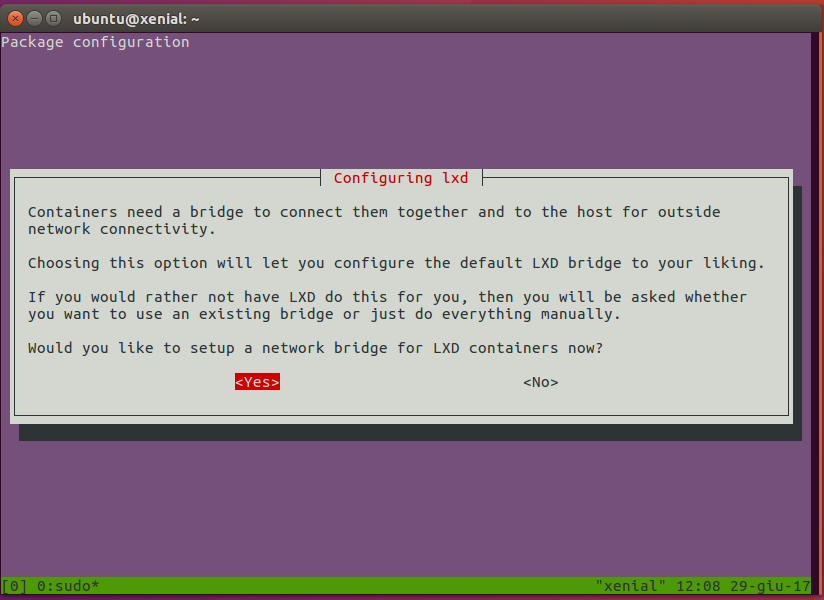
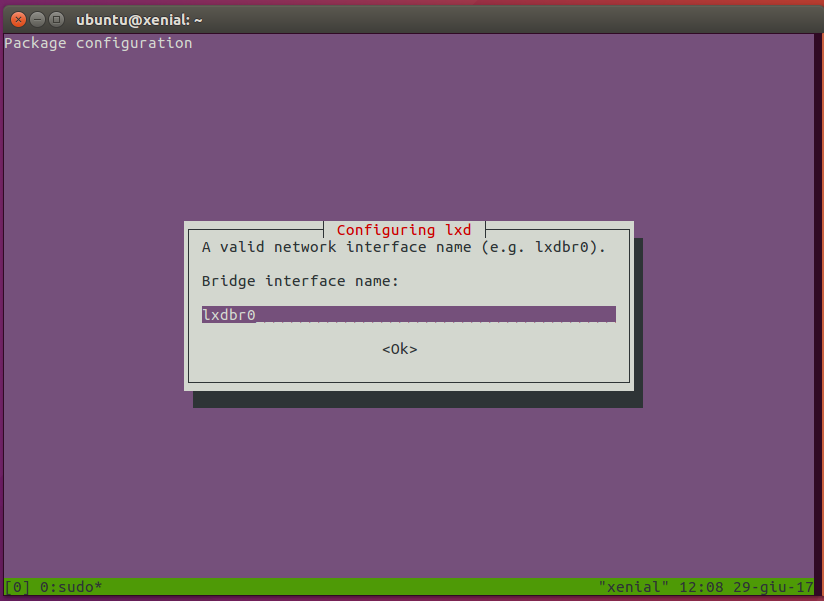
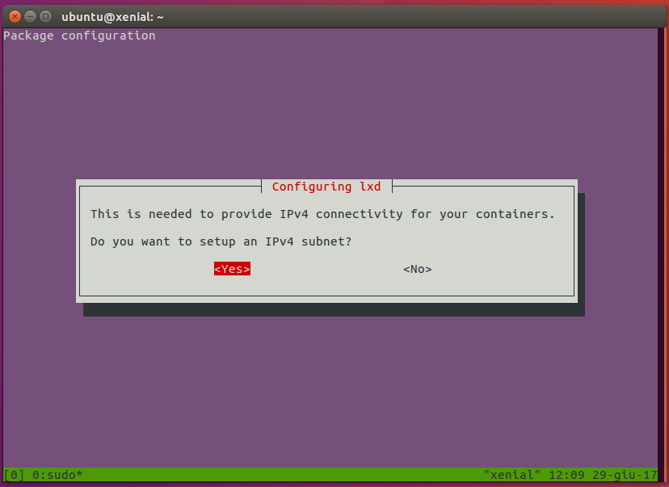

# Konfiguracja LXD na Ubuntu 16.04

## Omówienie
Duration: 1:00

[LXD](https://linuxcontainers.org/lxd) jest hipernadzorcą kontenerów dostarczającym API w stylu ReST pozwalającym na zarządzanie kontenerami LXC.


Pozwala na uruchamianie kontenerów oraz zarządzanie ich zasobami, takimi jak dyski i sieci.

Ten poradnik przedstawi, jak zainstalować i skonfigurować LXD na Ubuntu 16.04 (Xenial Xerus) oraz jak uruchomić kontener i korzystać z niego.

### Wymagania

Ten poradnik wymaga zainstalowanego Ubuntu 16.04 (lub nowszego) (w wydaniu Desktop lub Server) z dostępem do internetu. Może to być zarówno fizyczny komputer, jak i wirtualna maszyna.


## Instalacja LXD
Duration: 4:00

Jeżeli korzystasz z serwerowego Ubuntu 16.04, LXD jest już zainstalowane.

Na Ubuntu Desktop musisz zainstalować je ręcznie. Wykonaj w terminalu następujące polecenie, aby zainstalować LXD:

```bash
sudo apt update && sudo apt install lxd
```

### Dodanie użytkownika do grupy LXD

Aby uzyskać lojalny dostęp do usługi LXD, musisz być członkiem grupy `lxd`.

Aby zostać członkiem, wykonaj:

```bash
sudo adduser <UŻYTKOWNIK> lxd
```

zamień `<UŻYTKOWNIK>` nazwą używanego konta.

Działanie to uzyska efekt przy następnym logowaniu. Aby zastosować je dla obecnej sesji, wykonaj:

```bash
newgrp lxd
```


### Instalacja narzędzi ZFS

W tym poradniku skonfigurujemy LXD, aby korzystał z systemu plików **ZFS**.

System plików ZFS posiada funkcję kopiowania przy zapisie i pozwala na korzystanie z zaawansowanych funkcji LXD, takich jak limity dla kontenerów, natychmiastowe tworzenie i przywracanie migawek, zoptymalizowana migracja i natychmiastowe tworzenie kontenerów z obrazu.

Aby zainstalować narzędzia ZFS, wykonaj

```bash
sudo apt install zfsutils-linux
```

## Konfiguracja LXD
Duration: 4:00

Możemy teraz przejść do konfiguracji usługi LXD.

Aby to zrobić, wykonaj:

```bash
sudo lxd init
```

Polecenie to zada kilka pytań dotyczących konfiguracji LXD.

Możesz wybrać domyślną opcję (klikając Enter) w większości przypadków. Możesz wybrać rozmiar urządzenia pętli zwrotnej dla ZFS na podstawie ilości wolnego miejsca na dysku.


W trakcie konfiguracji wstępnej można również skonfigurować sieć, więc utworzone kontenery będą dostępne z poziomu hosta.

W pierwszym pytaniu wybierz **Yes**, aby uzyskać dostęp do sieci.



Zaakceptuj domyślną nazwę mostku `lxdbr0`:



Skonfiguruj sieć IPv4 dla mostku wybierając **Yes**:



Otrzymasz pytania dotyczące szczegółów konfiguracji sieci IPv4, w szczególności:

 * adres
 * CIDR
 * początkowy i końcowy adres DHCP
 * maksymalna liczba klientów DHCP

Możesz zaakceptować domyślne ustawienia.

Pod koniec, wybierz **Yes** w pytaniu dotyczącym konfiguracji NAT.


W podobny sposób możesz skonfigurować sieć IPv6, ale możesz to zignorować i nie konfigurować IPv6.


Gotowe! LXD zostało skonfigurowane i możesz go już używać!


## Uruchamianie kontenerów
Duration: 2:00

Nadszedł czas, aby rozpocząć korzystanie z LXD.

Na początek, upewnijmy się że możemy połączyć się z usługą, wykonując:

```bash
lxc list
```

Wynik powinien wyglądać w ten sposób:

```bash
Generating a client certificate. This may take a minute...
If this is your first time using LXD, you should also run: sudo lxd init
To start your first container, try: lxc launch ubuntu:16.04

+------+-------+------+------+------+-----------+
| NAME | STATE | IPV4 | IPV6 | TYPE | SNAPSHOTS |
+------+-------+------+------+------+-----------+
```

co oznacza, że żaden kontener nie jest uruchomiony.

Teraz uruchomimy kontener z Ubuntu 16.04:

```bash
lxc launch ubuntu:16.04
```

Uzyskamy wynik podobny do tego:

```bash
Creating stirring-beagle
Starting stirring-beagle
```

W ten sposób pobierz obraz systemu Ubuntu 16.04 LTS i uruchomisz kontener oparty na nim.

Jeżeli nie została podana nazwa kontenera, zostanie wygenerowana losowa.

Sprawdźmy, czy nasz kontener działa używając polecenia `lxc list`:

```bash
+-----------------+---------+-----------------------+------+------------+-----------+
|      NAME       |  STATE  |         IPV4          | IPV6 |    TYPE    | SNAPSHOTS |
+-----------------+---------+-----------------------+------+------------+-----------+
| stirring-beagle | RUNNING | 10.147.177.171 (eth0) |      | PERSISTENT | 0         |
+-----------------+---------+-----------------------+------+------------+-----------+
```

Możemy wykonywać polecenia z poziomu kontenera używając `lxc exec`:

```bash
lxc exec stirring-beagle -- ls -la
```

co spowoduje wykonanie ich z poziomu użytkownika root w kontenerze.

```bash
total 7
drwx------  3 root root    5 Jun 29 11:29 .
drwxr-xr-x 22 root root   22 Jun 19 23:52 ..
-rw-r--r--  1 root root 3106 Oct 22  2015 .bashrc
-rw-r--r--  1 root root  148 Aug 17  2015 .profile
drwx------  2 root root    3 Jun 29 11:29 .ssh
```

Możesz uzyskać dostęp do powłoki kontenera poleceniem `lxc exec stirring-beagle /bin/bash`

Ponieważ skonfigurowaliśmy sieć, kontener posiada również adres IPv4 (widoczny w `lxc list`), więc możesz uzyskać dostęp do niego z poziomu SSH na urządzeniu hosta. Wymaga o uprzedniego importowania klucza SSH w kontenerze.

Jeżeli nie potrzebujemy już kontenera, możemy go zatrzymać:

```bash
lxc stop stirring-beagle
```

i usunąć:

```bash
lxc delete stirring-beagle
```


## To wszystko!

Udało Ci się skonfigurować urządzenie do korzystania z kontenerów LXD.

LXD posiada wiele innych funkcji i pozwala na sporą dowolność w konfigurowaniu kontenerów i ograniczaniu zasobów i dostępu.

Jeżeli chcesz dowiedzieć się więcej o LXD i jego zaawansowanych możliwościach, skorzystaj z następujących zasobów.

* [Podręcznik pierwszego użycia (w języku angielskim)](https://linuxcontainers.org/lxd/getting-started-cli/)
* [Dokumentacja LXD w kodzie źródłowym (w języku angielskim)](https://github.com/lxc/lxd)

Jeżeli masz jakieś pytania lub potrzebujesz pomocy, możesz uzyskać pomoc na:

* [Forum Linux Containers](https://discuss.linuxcontainers.org/)
* [Ask Ubuntu](https://askubuntu.com/)
* Kanale IRC `#lxcontainers` w sieci Freenode
