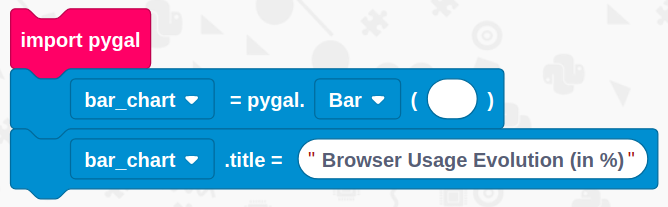
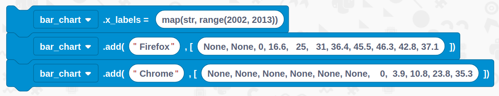
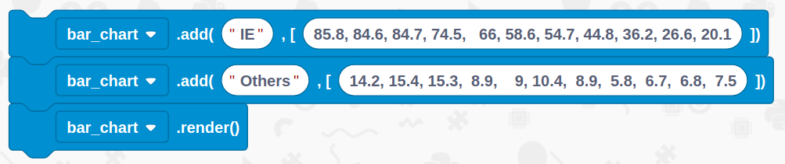
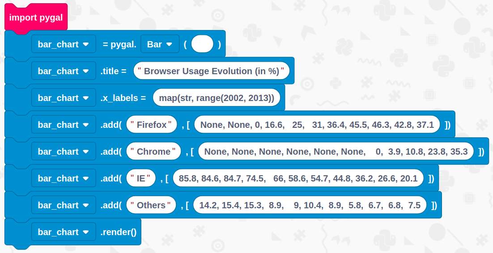

# Create a graph

## Overview

In this tutorial we are going to learn how to use Python 3, EduBlocks & PyGal to create a graph.

You will need 
- An internet connection
- A computer with a web browser

## Get Started
Duration: 1:00

You’ll need to load up EduBlocks. You can do this by opening a web browser of your choice and typing [https://app.edublocks.org](https://app.edublocks.org) into the search box. Once you've loaded up EduBlocks, you'll be presented with the mode selector. 

Now, we want to select the Python 3 mode. To do this simply click on the blue select button underneath the Python icon. This will load up the Python mode.

Once you've selected the Python mode, you should see it pop up:

## Import, setup and title
Duration: 3:00

Now its time to build our code. We can drag our code blocks from the EduBlocks toolbar which is on the left hand side of the screen. Our first block can be found in Imports, `import pygal`. This will import the library we need to create a graph. The next block can be found in Graphs, `name = pygal.Line()`, drag this underneath the import. Next, change name to `bar_chart` using the dropdown and selecting Rename Variable, then, change Line to Bar in order to create a bar chart. 

positive
: **NOTE:**
From here on, change all blocks that say Name to bar_chart

You'll now need to get a `name.title = "My Awesome Chart!"` block from Graphs, change the title to `Browser Usage Evolution (in %)` and put it underneath the last block.

## Create the X axis labels and add some data
Duration: 3:00

Next, we need to create the labels on the X axis. To do this, from Graphs get a `name.x_labels = ` block and put it underneath your previous code. Change the blank box to `map(str, range(2002, 2013))`, this will add all the years that we need to our graph. 

Now let's add some data! Grab a `name.add("Label", [1, 3, 8, 3])` block from Graphs and snap it underneath the last block. Change Label to `Firefox` and then the numbers to `None, None, 0, 16.6,   25,   31, 36.4, 45.5, 46.3, 42.8, 37.1`.

For the next block, get another add block but replace label with `Chrome` and the numbers with `None, None, None, None, None, None, 0,  3.9, 10.8, 23.8, 35.3`.

## Add some more data and render
Duration: 3:00

Let's add some more data! Get another add block and replace label with `IE` and the numbers with `85.8, 84.6, 84.7, 74.5, 66, 58.6, 54.7, 44.8, 36.2, 26.6, 20.1`.

Then get another add block and replace label with `Others` and the numbers with `14.2, 15.4, 15.3,  8.9, 9, 10.4,  8.9,  5.8,  6.7,  6.8,  7.5`.

We've now added all our data and therefore we need to render our graph, to do this, get a `name.render()` block from Graphs and put it at the bottom of your code.

## Final Code
Duration: 1:00

You've now finished all of the code! It's time to check to see if we haven't missed a step or made a mistake. Now is your chance to check your code compared to the image below to check if it's all right.

## Run your code
Duration: 2:00

It's time to run our code!
Press the green run button in the top right hand corner, this will load up the python environment called Trinket that will run our program.

You should now see your finished Graph!

### What you've learnt

  - Learnt how to import libraries
  - Learnt how to use PyGal to create graphs

