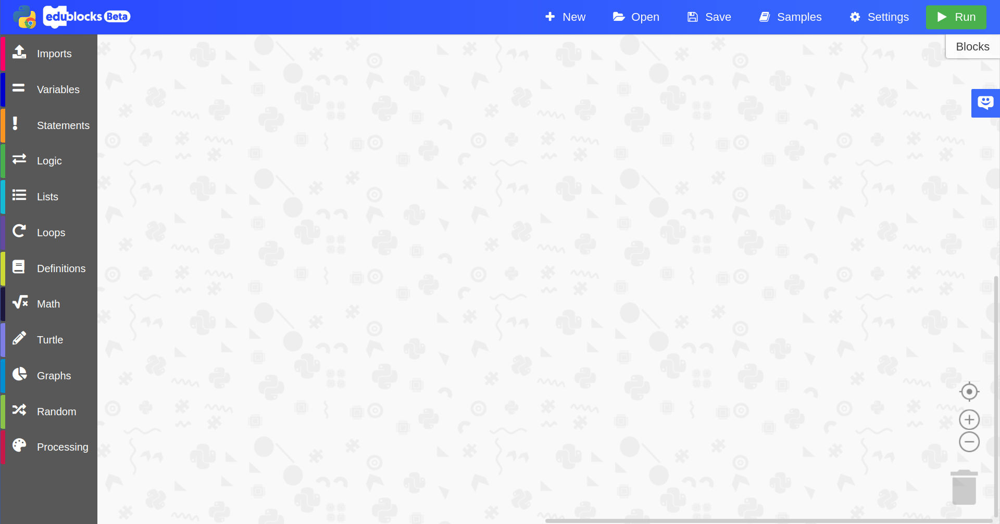
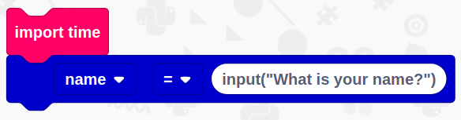
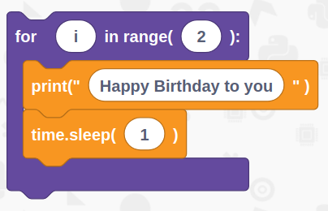
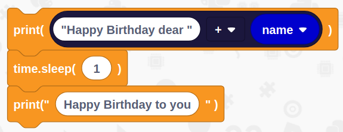
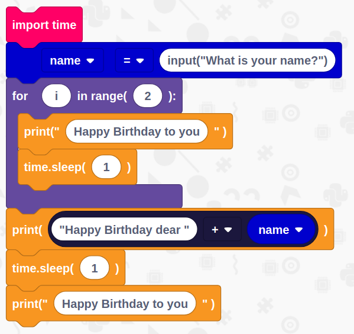
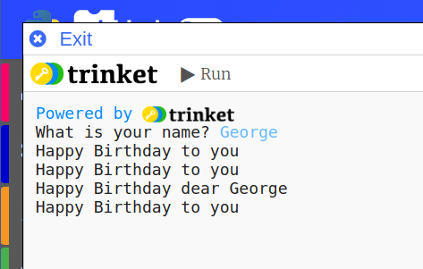

# Happy Birthday Song

## Overview

In this tutorial we are going to learn how to use basic python skills to create a happy birthday song in python

You will need 
- An internet connection
- A computer with a web browser

## Get Started
Duration: 1:00

You’ll need to load up EduBlocks. You can do this by opening a web browser of your choice and typing [https://app.edublocks.org](https://app.edublocks.org) into the search box. Once you've loaded up EduBlocks, you'll be presented with the mode selector. 

Now, we want to select the Python 3 mode. To do this simply click on the blue select button underneath the Python icon. This will load up the Python mode.

Once you've selected the Python mode, you should see it pop up:

## Import & Input
Duration: 2:00

Now its time to build our code. We can drag our code blocks from the EduBlocks toolbar which is on the left hand side of the screen. Our first block can be found in Imports, `import time`. This will import the library we need to wait inbetween lines. Next, create a variable, to do this go into Variables and select "Create Variable", name it `name`. Then from variables drag a `name = 0` block and snap it underneath the import. Change the input to `input("What is your name?)`, this will ask the user a question.

## Create a loop and add some lines
Duration: 3:00

Now we need to create a loop to repeat some lines in the song, we do this instead of repeating these lines as separate blocks. Go into Loops and drag a `for i in range(number)` block, snap it underneath the variable block. Change number to `2` in order to repeat the code in the loop twice. 

Let's add some code to the loop, go to statements and grab a `print("Hello World")` block and put it inside the for loop. Change the `Hello world` text to `Happy Birthday to you`. Then, go back into statements and get a `time.sleep(1)` block and put it underneath the print block, this will make the code wait for a second.

## Print the persons name
Duration: 3:00

Onto the final section. The rest of the code will go underneath the for loop instead of inside it. In statements, get a `print(Variable)` block and put it underneath the for loop. Then, from math, get a `True + True` and drag it inside where it says Variable. Change the first true to `"Happy birthday dear "` and then get a `name` block from variables and put it where the second True is.

Now we need to sleep again, to do this, get a `time.sleep(1)` block from statements.

To finish our program off, get a `print("Hello World")` block from statements and replace `Hello world` with `"Happy Birthday to you"`.

## Final Code
Duration: 1:00

You've now finished all of the code! It's time to check to see if we haven't missed a step or made a mistake. Now is your chance to check your code compared to the image below to check if it's all right.

## Run your code
Duration: 2:00

It's time to run our code!
Press the green run button in the top right hand corner, this will load up the python environment called Trinket that will run our program.

When prompted, type in your name and press enter. Python will then sing happy birthday to you!

### What you've learnt

  - Learnt how to import libraries
  - Learnt how to use inputs
  - Learnt how to use print statements
  - Learnt how to use the time library
  - Learn how to use a loop

