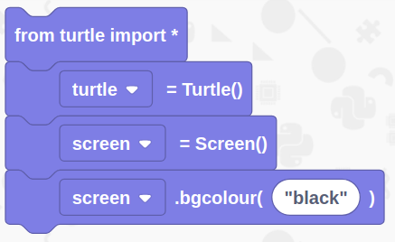
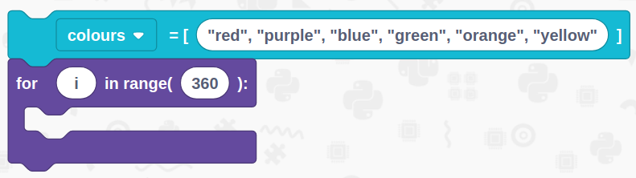
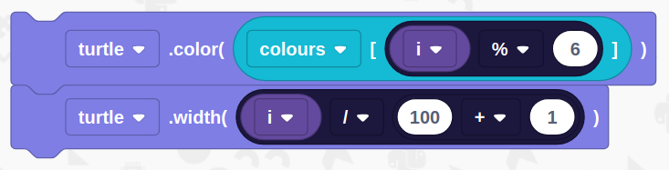
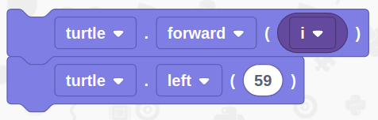
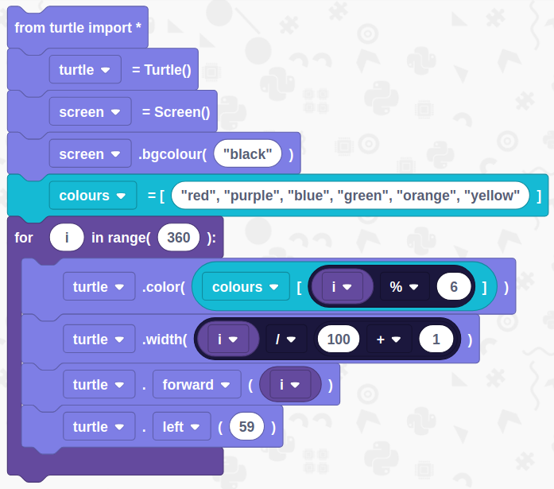
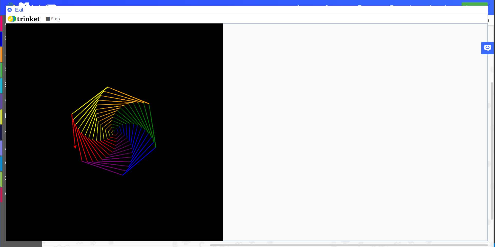

# Turtle Spirals

## Overview

In this tutorial we are going to make a colourful rainbow spiral using the Python 3 mode and the turtle library.

You will need 
- An internet connection
- A computer with a web browser

## Get Started
Duration: 1:00

You’ll need to load up EduBlocks. You can do this by opening a web browser of your choice and typing [https://app.edublocks.org](https://app.edublocks.org) into the search box. Once you've loaded up EduBlocks, you'll be presented with the mode selector. 

Now, we want to select the Python 3 mode. To do this simply click on the blue select button underneath the Python icon. This will load up the Python mode.

Once you've selected the Python mode, you should see it pop up:

## Imports, setup and background colour
Duration: 1:00

Now its time to build our code. We can drag our code blocks from the EduBlocks toolbar which is on the left hand side of the screen. All of our block can be found in the turtle menu of the toolbar. The first block will import all the turtle commands, the second block will setup our turtle "pen", the third block will setup the screen environment and the last block will set the screen environments background colour to black. For basic colour you can name them, for example `"red"` but for more complicated colours you can use RGB values like `144, 255, 80`.

## Create a list and loop
Duration: 3:00

Next, we need to create a list. We can do this by going into the lists category and dragging a `list = [1, 2, 3, 4]` block. Snap this underneath the last section of code. Rename the list by clicking the dropdown on the block and click `Rename Variable` button and call the list `colours`. Now you need to replace `1,2,3,4` with the colours we want to use: `"red", "purple", "blue", "green", "orange", "yellow"`.

Now, go into loops and get a block which states `for i in range(number)`, drag this underneath the list block we have just created. Change number to `360`.

positive
: **NOTE:**
From here on, the rest of the code will put inside of this loop.

## Change colour and set the width
Duration: 7:00

Our next section is the most complicated, this is where we'll do the maths to change the colour and width to create the spiral effect. Get a block from turtle that states `turtle.color(255,0,0)`, put this inside the if statement. Now, go into lists and get a rounded block that states `list[3]`, put this block where it says `255, 0, 0` in the turtle block, change list to colours. Now go into maths and get a `True + True` block and drag it into the number 3 on the list block, change the + to % by using the dropdown. In the first true, drag an `i` block from loops and change the second true to 6.

After that block, we need a `turtle.width(20)` block from Turtle, put this underneath the colour block. Now, from maths, get a True + True block and put in in place of 20, change the + to a / and then replace the first true with an `i` block from loops. Back in maths, get another True + True block and put in in place of the second True in the previous one. In this new block, replace the first true with 100 and the second with a 1.

## Move the turtle
Duration: 3:00

Onto the final section. Get a `turtle.forward(90)` block from Turtle, snap this underneath the width block and replace the 90 with an `i` block from loops. Now back in turtle, get another `turtle.forward(90)` block and change forward to left using the dropdown then replace 90 with 59. These blocks will move the turtle to create the sprial shape.

## Final Code
Duration: 1:00

You've now finished all of the code! It's time to check to see if we haven't missed a step or made a mistake. Now is your chance to check your code compared to the image below to check if it's all right.

## Run your code
Duration: 4:00

It's time to run our code!
Press the green run button in the top right hand corner, this will load up the python environment called Trinket that will run our program.

You should now see your spiral be formed!

### What you've learnt

  - Learnt how to create a list
  - Learnt how to use maths tools
  - Learnt how to use a loop
  - Learnt how to use the turtle library
