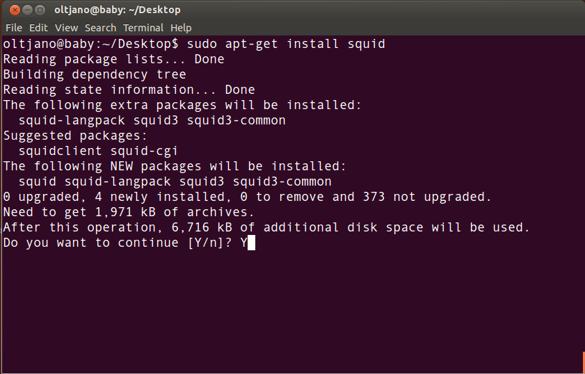
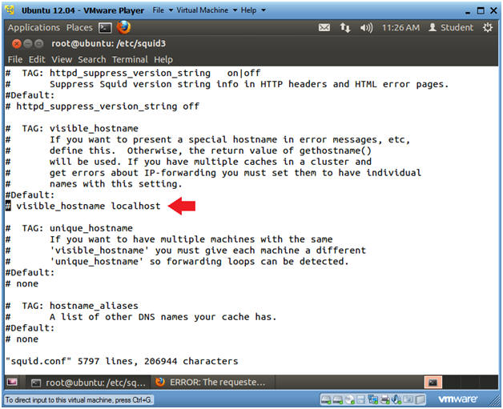

 ---
 id: Tutorial for a caching proxy
 
 summary: A simple guide for installing and configuring a caching proxy
 
 categories: Desktop
 
 tags: guide,write,contribute
 
 difficulty: 3
 
 Duration: 8:00
 
 status: Published
 
 feedback-url: https://github.com/canonical-websites/tutorials.ubuntu.com/issues
 
 author: Tanesh Chuckowree <arvesh1701@gmail.com>
 
 published: 2017-12-06
 
 ---
 
## Overview
 In this tutorial,we will be installing and configuring a caching proxy-Squid,which is one of the best proxies out there.
 
 
 
 There are many reasons why a proxy server is important:
 
- For sharing internet connection on a LAN
- To speed up internet surfing
- For anonymous surfing

## What you'll need

- Ubuntu Desktop 16.04 or above
- Good command-line knowledge

## This is the first step

  For the first step,we will be installing Squid using the Terminal.Without further ado,lets type in the command
  
                       `sudo apt install squid`
                       
 
  
## This is the second step
Duration:

  Now that we have already installed Squid,we will be configuring it.The configuration of the Squid Proxy Server is handled in the /etc/squid/squid.conf.(We can also check if Squid is running properly by typing in the command-`sudo service squid status`)
  
  As such we can also change the TCP port that our Squid Server is using.To do this we type in the following command in the terminal:
  
                            `http_port ....`(ex:8888 instead of 3128(default one))
            
  We can also change the hostname with the following command:
  
                            `visible_hostname .......`
                            
  
                            
                            
  We man also allow internet services proxied by Squid only available to some users with this command which we must ad at the bottom of the acl function: 
  
  
                            `acl fortytwo_network src "your Ip"`
                               
                             for xample: `acl fortytwo_network src 192.168.42.0/24`
                             
  Then add the following command to the top of the acl of/etc/squid/squid.conf
  
                            `http_access allow biz_network biz_hours`
`
            
## Third and last step

Now that we have configured Squid,we must now restart it to apply the changes to it.

                               `sudo systemctl restart squid.service`
                               
                               
## And thats all folks....Feel free to explore the other commands

 
 

  
  
  
  
  
  
  
  
  
  
  
  
  
  
  
  
  
  
  
  
  
  
  
  
  
  
  
  

  
  
  

 
 
 
