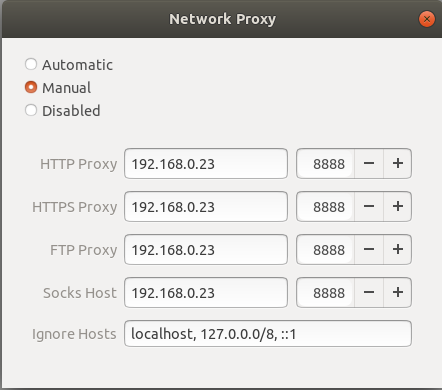
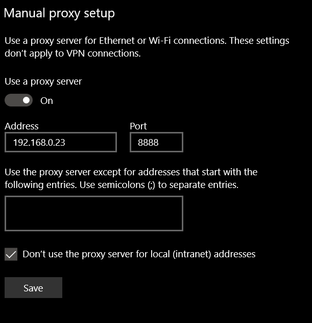

# Install a caching proxy using squid

## Overview
Duration: 2:00

In this tutorial, we will go over how to install a caching proxy. Caching proxies are used to keep local caches of webpages so that there is a minimized wait time to access internet files. Caching proxies can be placed either on the router or separate from the router, in this tutorial, we will place it separate from the router as this is the most common use case.

### What You'll Learn:

* How to install squid
* How to configure squid
* How to connect to the proxy

### What You'll Need

* A computer running Ubuntu 16.04 Xenial Xerus or above
* Updated apt package lists (you can do this in terminal using `sudo apt-get update`)
* A basic understanding of how proxies and caching proxies work
* To be comfortable using terminal
* A stable internet connection
* Local Area Network (LAN)

Survey
: How will you use this tutorial?
- Only read through it
- Read it and complete the exercises
: What is your current level of experience?
- Novice
- Intermediate
- Proficient

## Installing Squid
Duration:1:00

We will install squid using apt, there is only one package to install.
This is very simple:
```bash
sudo apt-get install squid
```

Thats It! You can continue to the next page to configure squid.

## Configuring Squid
Duration: 5:00

We now need to edit the squid configuration file, this is a very large file and I recommend deleting the file and pasting the following contents into it.
We start by navigating to the directory containing the config file. It is found in `/etc/squid/squid.conf`
```bash
cd /etc/squid
sudo rm squid.conf
sudo nano
```
Now paste the following then exit using `ctrl`+`x` and name the file `squid.conf`
```bash
http_port 8888

acl localnet src 10.0.0.0/8     # RFC1918 possible internal network
acl localnet src 172.16.0.0/12  # RFC1918 possible internal network
acl localnet src 192.168.0.0/16 # RFC1918 possible internal network
acl localnet src fc00::/7       # RFC 4193 local private network range
acl localnet src fe80::/10      # RFC 4291 link-local (directly plugged) machines

acl SSL_ports port 443          # SSL

acl Safe_ports port 80          # http
acl Safe_ports port 21          # ftp
acl Safe_ports port 443         # https
acl Safe_ports port 70          # gopher
acl Safe_ports port 210         # wais
acl Safe_ports port 280         # http-mgmt
acl Safe_ports port 488         # gss-http
acl Safe_ports port 591         # filemaker
acl Safe_ports port 777         # multiling http
acl Safe_ports port 1025-65535  # unregistered ports


acl CONNECT method CONNECT

http_access deny !Safe_ports
http_access deny CONNECT !SSL_ports
http_access allow localhost manager
http_access deny manager

#
# INSERT YOUR OWN RULE(S) HERE TO ALLOW ACCESS FROM YOUR CLIENTS
#

http_access allow localnet
http_access allow localhost
http_access allow Safe_ports
http_access allow all
http_access deny all

coredump_dir /squid/var/cache/squid

refresh_pattern ^ftp:           1440    20%     10080
refresh_pattern ^gopher:        1440    0%      1440
refresh_pattern -i (/cgi-bin/|\?) 0     0%      0
refresh_pattern .               0       20%     4320
```
If you're in the mood to hack a little, all the options are described on the [squid cache website](http://www.squid-cache.org/Versions/v4/cfgman/index.html#toc_acl) and can be changed to fit your needs.

## Setting up a connection
Duration: 5:00

positive
: **Make sure that port 8888 is forwarded to your server if connecting using an external ip**
This also applies to ufw settings as well:
`sudo ufw allow 8888`

### Ubuntu

On Ubuntu 17.10 we can connect to the proxy in Settings --> Network --> Network Proxy and click the gear, we can fill in the following, replacing 192.168.0.23 with your own ip address



### Windows

On Windows 10 we can connect to the proxy in Settings --> Network and Internet --> Proxy --> Manual Proxy Setup, fill in the following, replacing 192.168.0.23 with your own ip address



### iOS

On iOS 11, proxies can be configured as seen below, be sure to replace 192.168.0.23 with your own ip address


## You're Done!
Duration: 2:00

We are now connecting to cached webpages over http and https through a squid caching proxy. The underlying program, squid, has many other features including filtering using acl, these can be found at the [squid cache website](http://www.squid-cache.org/Versions/v4/cfgman/index.html#toc_acl).

###You now know how to:

* Prepare an environment to install a caching proxy
* Install squid
* Configure squid

###What's Next?

* Modify your external internet connection to forward port 8888
* Ensure your network has a static IP address
* Set up a connection to your proxy on common distributions

###I Need Help

* Double Check that the port is available
* Check your router's port forwarding configuration (external connection)
* Ensure the configuration file is correct
* Make sure you typed the commands properly
* Try using sudo (if you aren't already) i.e. `sudo` + `command`
* Ask a question on [Ask Ubuntu](https://askubuntu.com/questions/ask)
