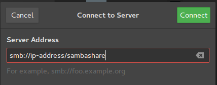
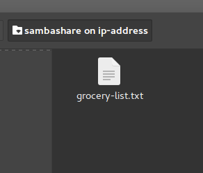

# Install and Configure Samba

## Overview
Duration: 1:00

A Samba file server enables file sharing across different operating systems over a network. It lets you access your desktop files from a laptop and share files with Windows and macOS users.

This guide covers the installation and configuration of Samba on Ubuntu.

### What you'll learn
- How to set up a Samba file server
- How to share files across a local network

### What you'll need
- Ubuntu 16.04 LTS
- A Local Area Network (LAN) to share files over

If you have everything ready, let's dive straight into the installation process on the next step!

## Installing Samba
Duration: 1:00

To install Samba, we run:
```bash
sudo apt update
sudo apt install samba
```
We can check if the installation was successful by running:
```bash
whereis samba
```
The following should be its output:
```bash
samba: /usr/sbin/samba /usr/lib/samba /etc/samba /usr/share/samba /usr/share/man/man7/samba.7.gz /usr/share/man/man8/samba.8.gz
```

## Setting up Samba
Duration: 2:00

Now that Samba is installed, we need to create a directory for it to share:
```bash
mkdir /home/<username>/sambashare/
```
The command above creates a new folder `sambashare` in our home directory which we will share later.

The configuration file for Samba is located at `/etc/samba/smb.conf`. To add the new directory as a share, we edit the file by running:
```bash
sudo nano /etc/samba/smb.conf
```
At the bottom of the file, add the following lines:
```
[sambashare]
    comment = Samba on Ubuntu
    path = /home/username/sambashare
    read only = no
    browsable = yes
```
Then press `Ctrl-O` to save and `Ctrl-X` to exit from the *nano* text editor.


### What we've just added
- [sambashare]: The name inside the brackets is the name of our share.
- comment: A brief description of the share.
- path: The directory of our share.
- read only: Permission to modify the contents of the share folder is only granted when the value of this directive is `no`.
- browsable: When set to `yes`, file managers such as Ubuntu's default file manager will list this share under "Network".

Now that we have our new share configured, save it and restart Samba for it to take effect:
```bash
sudo service smbd restart
```

## Setting up User Accounts and Connecting to Share
Duration: 1:00

Since Samba doesn't use the system account password, we need to set up a Samba password for our user account:
```bash
sudo smbpasswd -a username
```

negative
: **Note**
Username used must belong to a system account, else it won't save.

### Connecting to Share
On Ubuntu:
Open up the default file manager and click *Connect to Server* then enter:


On macOS:
In the Finder menu, click *Go > Connect to Server* then enter:


On Windows, open up File Manager and edit the file path to:
```address
\\ip-address\sambashare
```
Note: `ip-address` is the Samba server IP address and `sambashare` is the name of the share.

You'll be prompted for your credentials. Enter them to connect!


### If you'd like to take your configuration further...
- [Samba Server Guide](https://help.ubuntu.com/community/Samba/SambaServerGuide)
